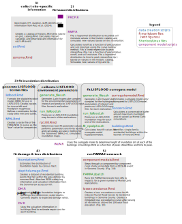

# PARRA

This repository provides supplementary information to the paper XX (doi:XX). It contains the code to implement the Performance-Based Atmospheric River Risk Analysis (PARRA) framework, which is illustrated in the following figure (Figure 1 from the paper):

This is the theoretical outline of the PARRA framework. Here we show the implementation. 

* <a href="https://corinnebowers.github.io/sonoma.html">sonoma.Rmd</a>: generates a figure of Sonoam County with rivers, creeks, and major cities/towns identified, as well as a figure inset of California for context
* <a href="https://corinnebowers.github.io/rp100.html">rp100.Rmd</a>: performs sensitivity analysis and best-fit calibration for LISFLOOD environmental parameters (floodplain roughness, channel shape, etc.) 
* surrogatemodel.Rmd:
* componentmodels.Rmd:
* lossexceedance.Rmd:

