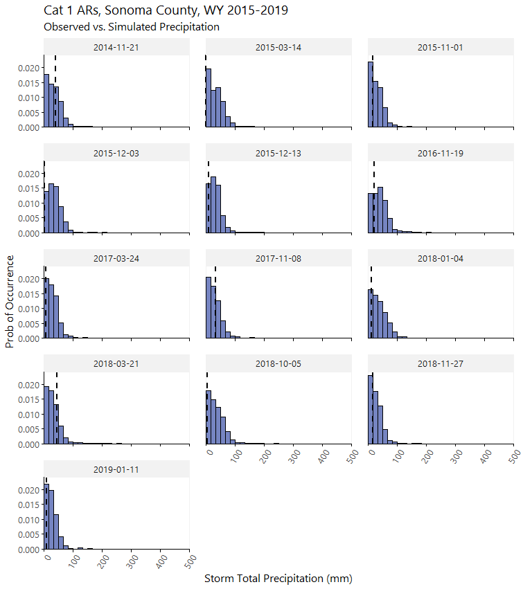
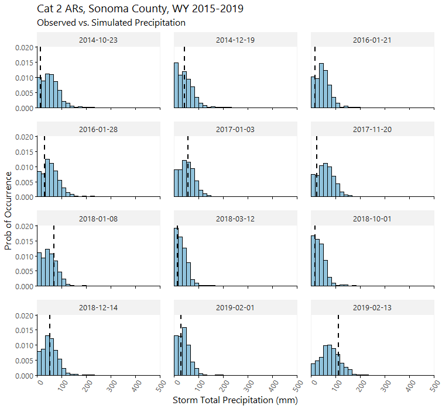
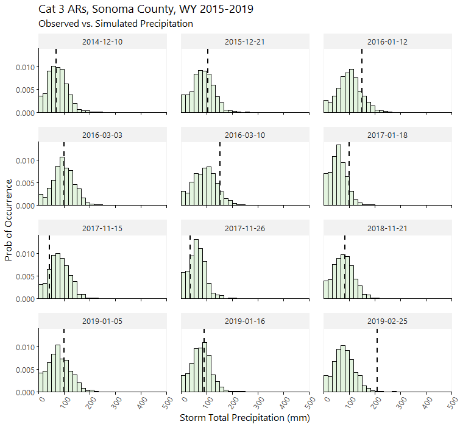
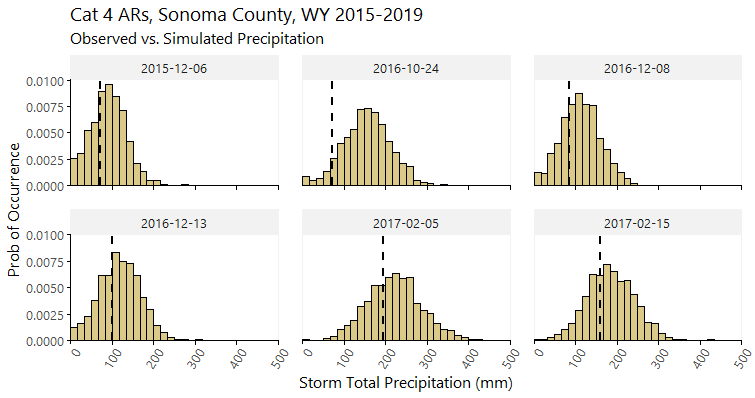
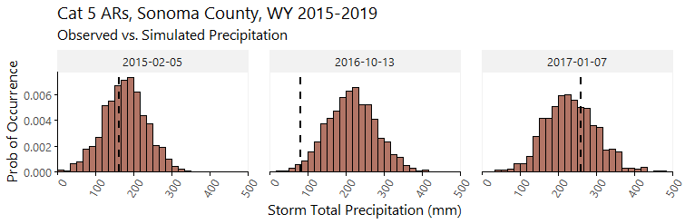
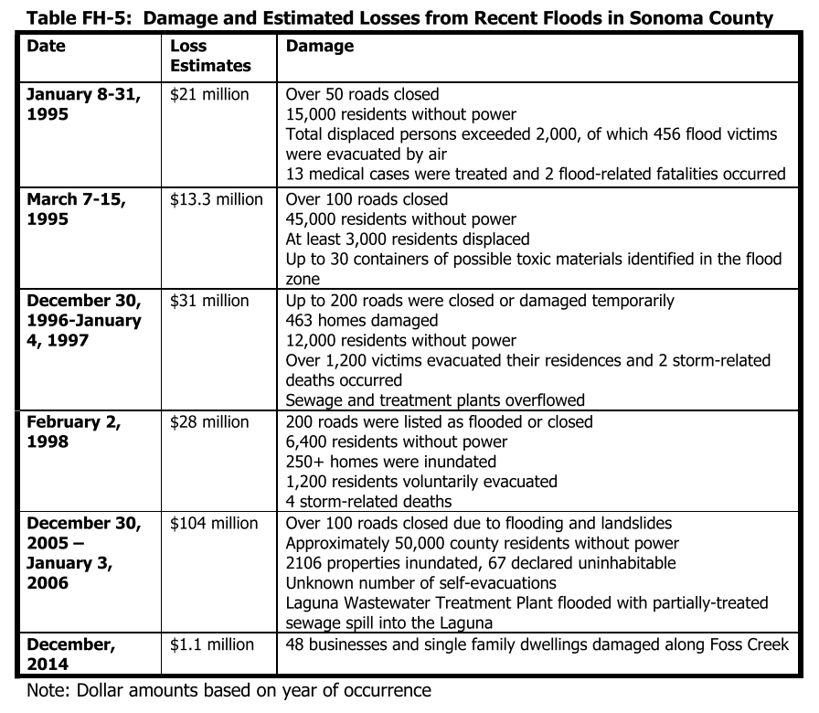
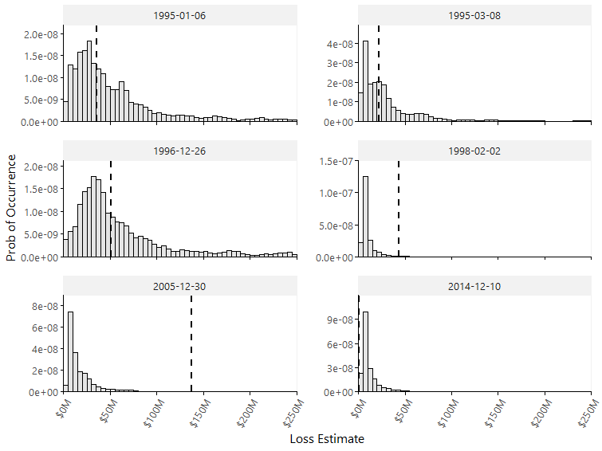

# Precipitation

These plots show the observed vs. simulated basin-wide precipitation
totals for all AR events in the five wet seasons from WY2015-2019
(October 2014 – March 2019).

# Loss

Here we present the observed vs. simulated loss for the six events cited
in the 2017 version of Sonoma County’s Hazard Mitigation Plan. The
following is an excerpt from that document showing notable storms in the
decades preceding the report.

We scaled the observed loss totals to 2019 dollars and compared them to
the simulated loss histograms for each event.

