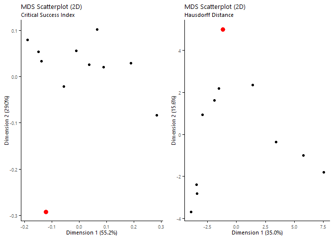
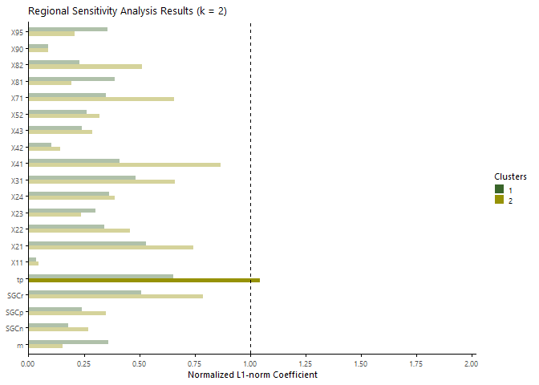
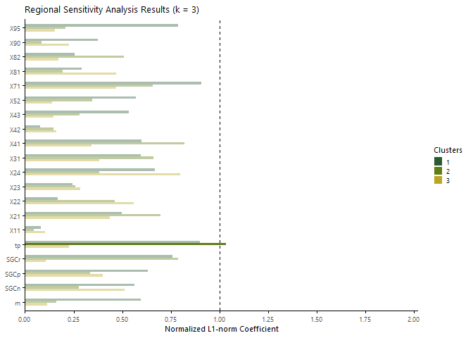
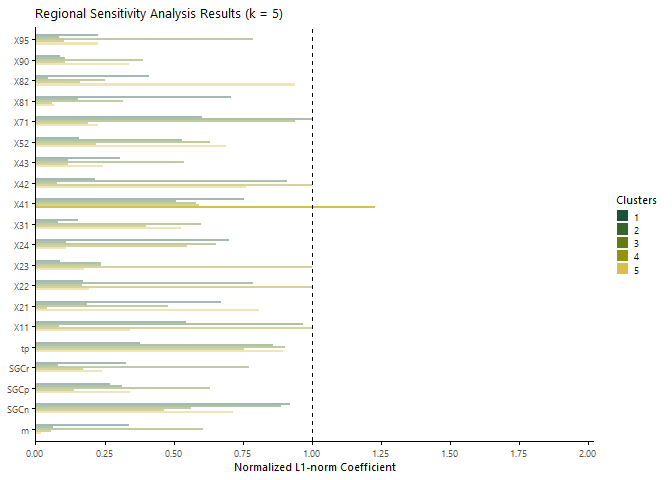
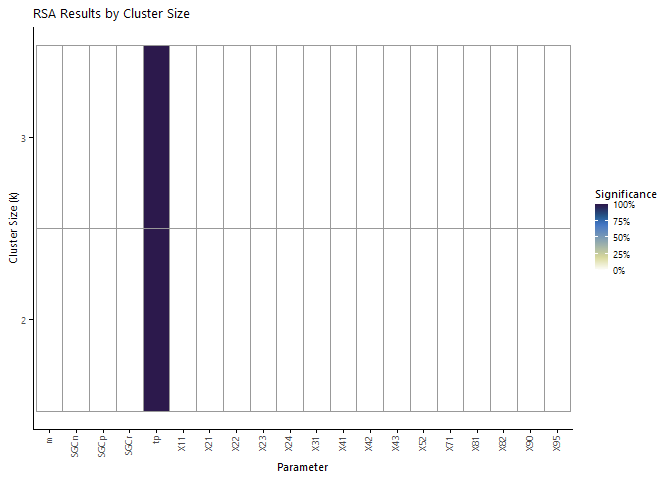
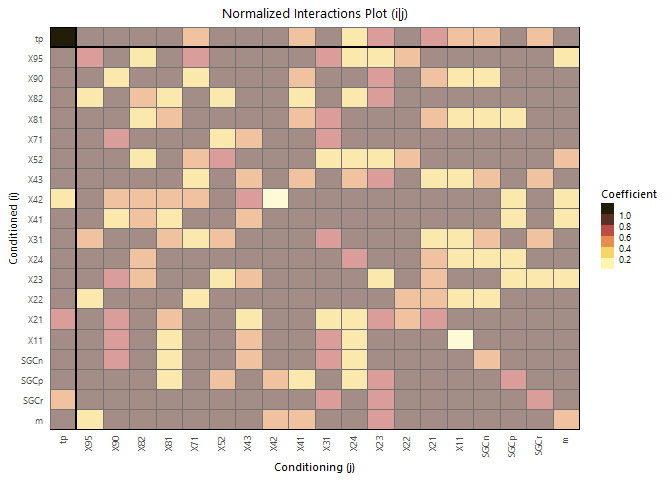
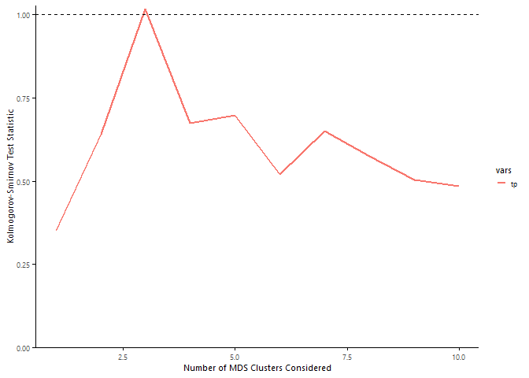

% a) Fit LISFLOOD parameters

This folder represents step 1 in fitting the inundation component model.
The purpose of this step is to (a) find out which parameters produce the
best-fit LISFLOOD model of the 100-year floodplain in Sonoma County, and
(b) determine which parameters the results are sensitive to.

    ## setup information
    source('_data/setup.R')
    source('_data/plots.R')

    ## set random seed for reproducibility
    set.seed(2021)

    ## set parallel backend
    num_cores <- 5

    ## load location information
    load('_data/lisflood/dem.Rdata')
    load('_data/aoi/aoi.Rdata')

    ## load NFHL "observed" data
    load('_data/NFHL/NFHL.Rdata')

    ## load support functions for this markdown files
    source('_scripts/5_INUN/fit_inundation/5a_fit_lisflood/fit_lisflood_functions.R')

# 1 Generate LISFLOOD simulations

The first goal is to define the parameters of interest and calculate
inundation maps for those sets of parameters. This process was completed
using Sherlock, Stanford’s high-performance computing cluster. An
outline of that process is enumerated below.

1.  Input user-defined parameters in the appropriate section in
    `generate_files.R`.
2.  Run `generate_files.sbatch` to
    1.  generate random samples of LISFLOOD parameter values using Latin
        hypercube sampling (LHS), and
    2.  create .bci, .bdy, and .n.asc files based on those random
        parameter values for each sample index.
3.  Run `run_lisflood.sh` to generate .par files and calculate LISFLOOD
    inundation maps for each sample index.
4.  Once all simulations have finished running, run
    `cleanup_lisflood.sh` to organize LISFLOOD output files. *Please
    note that this could be several hours or days.*
5.  Run `generate_files_2.sbatch` to identify failed LISFLOOD model runs
    (either did not finish or did not reach the ocean) and recalculate
    .bci, .bdy, and .n.asc files for these indices.
6.  Run `run_lisflood_2.sh` to regenerate .par files and recalculate
    LISFLOOD inundation maps for the failed model runs.
7.  Iterate steps 4-6 until the number of failed model runs meets some
    acceptable threshold, i.e. less than 5% of all indices.

This establishes a database of LISFLOOD runs we can draw from to
determine which parameters significantly impact inundation results and
to estimate best-fit values for those sensitive parameters.

# 2 Determine accuracy metrics

The next goal is to determine some measure of accuracy, i.e. how well
the LISFLOOD simulations are able to recreate the “true” case. In this
case the data used as a source of truth is the Federal Emergency
Management Program (FEMA) 100-year floodplain as downloaded from the
National Flood Hazard Layer (NFHL). This is a fairly standard practice
for validating flood models, such as the one used by First Street
Foundation (Wing et al., 2020). We estimated the peak inflow at USGS
gage 11463500 to be
*Q**p* = 112, 000 *c**f**s* = 3, 171 *m*3/*s*
using the USGS StreamStats tool. This value is fixed, and several other
parameters are varied to find the best-fit LISFLOOD model. We consider
twenty different parameters that can be changed in the LISFLOOD model to
modify the resulting inundation map. A table of these parameters and the
values considered for each parameter is included below.

We then compare these 1,000 simulated inundation maps to the FEMA NFHL
using two different accuracy metrics: the critical success ratio (fstat)
and the Hausdorff distance (hausdorff). The critical success ratio is a
the ratio of correctly predicted flood cells (i.e. true positives) over
all flood cells (i.e. true positives + true negatives + false
positives). This produces a balanced measure of over-
vs. under-prediction. The Hausdorff distance is a spatial measure of how
well the shape of the simulated floodplain matches the shape of the FEMA
NFHL. It is important to note that both of these accuracy metrics are
meant to measure the goodness-of-fit of binary (i.e. wet/dry) outcomes.
While LISFLOOD outputs a flood depth at every location, the NFHL data
does not provide this information, and therefore all validation was
performed only on the quality of the fit between the “true”
vs. simulated 100-year flood extents.

## 2.1 Compute accuracy metrics (critical success ratio & Hausdorff distance) for each inundation map

    ## load simulated data
    samples.rp100 <-
      read.table('_scripts/5_INUN/fit_inundation/5a_fit_lisflood/samples_lisflood.txt', header = TRUE)
    vars <- names(samples.rp100)
    N <- 100 #nrow(samples.rp100)
    id <- read.table('_scripts/5_INUN/fit_inundation/5a_fit_lisflood/id.txt') %>%
      unlist %>% unname
    sim.list <- (1:N)[!(1:N %in% id)]

    # ## compute accuracy metrics
    # start <- Sys.time()
    # pb <- txtProgressBar(min = 0, max = N, style = 3)
    # cl <- parallel::makeCluster(num_cores)
    # registerDoSNOW(cl)
    # accuracy <-
    #   foreach(i = sim.list, .inorder = FALSE,
    #     .combine = 'rbind', .export = c('confusion', 'binary'),
    #     .options.snow = list(progress = function(n) setTxtProgressBar(pb, n)),
    #     .packages = c('raster', 'dplyr', 'pracma')) %dorng% {
    #       
    #       ## load LISFLOOD inundation map
    #       sim <- paste0('_scripts/5_INUN/fit_inundation/5a_fit_lisflood/results/fitrp', i, '.max') %>%
    #         raster %>% overlay(dem.hydro, fun = function(x,y) ifelse(is.na(y), NA, x))
    # 
    #       ## calculate confusion matrix
    #       tb <- overlay(obs, sim, fun = confusion)[] %>% table
    # 
    #       ## calculate Hausdorff distance
    #       hd <- hausdorff_dist(binary(sim), as.matrix(obs))
    # 
    #       ## save metrics as dataframe
    #       c(id = i,
    #         hitrate = unname(tb['0'] / (tb['-1'] + tb['0'])),
    #         falsalarm = unname(tb['1'] / (tb['0'] + tb['1'])),
    #         fstat = unname(tb['0'] / sum(tb)),
    #         bias = unname(tb['1'] / tb['-1']),
    #         hausdorff = hd)
    #     }
    # stopCluster(cl)
    # Sys.time() - start
    # 
    # ## save checkpoint
    # save(accuracy, file = '_scripts/5_INUN/fit_inundation/5a_fit_lisflood/checkpoints/accuracy.Rdata')
    load('_scripts/5_INUN/fit_inundation/5a_fit_lisflood/checkpoints/accuracy.Rdata')

    ## join to samples dataframe
    samples.rp100 <- samples.rp100 %>%
      mutate(id = 1:nrow(.)) %>% 
      left_join(data.frame(accuracy), by = 'id')

<table style="font-family: -apple-system, BlinkMacSystemFont, 'Segoe UI', Roboto, Oxygen, Ubuntu, Cantarell, 'Helvetica Neue', 'Fira Sans', 'Droid Sans', Arial, sans-serif; display: table; border-collapse: collapse; margin-left: auto; margin-right: auto; color: #333333; font-size: 16px; font-weight: normal; font-style: normal; background-color: #FFFFFF; width: auto; border-top-style: solid; border-top-width: 2px; border-top-color: #A8A8A8; border-right-style: none; border-right-width: 2px; border-right-color: #D3D3D3; border-bottom-style: solid; border-bottom-width: 2px; border-bottom-color: #A8A8A8; border-left-style: none; border-left-width: 2px; border-left-color: #D3D3D3;">
  <thead style="">
    <tr>
      <th colspan="5" style="background-color: #d9d9d9; text-align: center; border-bottom-color: #FFFFFF; border-left-style: none; border-left-width: 1px; border-left-color: #D3D3D3; border-right-style: none; border-right-width: 1px; border-right-color: #D3D3D3; color: #333333; font-size: 125%; font-weight: initial; padding-top: 4px; padding-bottom: 4px; border-bottom-width: 0; border-bottom-style: solid; border-bottom-width: 2px; border-bottom-color: #D3D3D3; font-weight: normal;" style>LISFLOOD Sensitivity Testing</th>
    </tr>
    
  </thead>
  <thead style="border-top-style: solid; border-top-width: 2px; border-top-color: #D3D3D3; border-bottom-style: solid; border-bottom-width: 2px; border-bottom-color: #D3D3D3; border-left-style: none; border-left-width: 1px; border-left-color: #D3D3D3; border-right-style: none; border-right-width: 1px; border-right-color: #D3D3D3;">
    <tr>
      <th style="color: #333333; background-color: #e5e5e5; font-size: 100%; font-weight: normal; text-transform: inherit; padding-top: 0; padding-bottom: 0; padding-left: 4px; padding-right: 4px; text-align: center;" rowspan="1" colspan="2">
        Parameters
      </th>
      <th style="color: #333333; background-color: #e5e5e5; font-size: 100%; font-weight: normal; text-transform: inherit; padding-top: 0; padding-bottom: 0; padding-left: 4px; padding-right: 4px; text-align: center;" rowspan="1" colspan="3">
        Values
      </th>
    </tr>
    <tr>
      <th style="color: #333333; background-color: #e5e5e5; font-size: 100%; font-weight: normal; text-transform: inherit; border-left-style: none; border-left-width: 1px; border-left-color: #D3D3D3; border-right-style: none; border-right-width: 1px; border-right-color: #D3D3D3; vertical-align: bottom; padding-top: 5px; padding-bottom: 6px; padding-left: 5px; padding-right: 5px; overflow-x: hidden; text-align: left;" rowspan="1" colspan="1">Name</th>
      <th style="color: #333333; background-color: #e5e5e5; font-size: 100%; font-weight: normal; text-transform: inherit; border-left-style: none; border-left-width: 1px; border-left-color: #D3D3D3; border-right-style: none; border-right-width: 1px; border-right-color: #D3D3D3; vertical-align: bottom; padding-top: 5px; padding-bottom: 6px; padding-left: 5px; padding-right: 5px; overflow-x: hidden; text-align: left;" rowspan="1" colspan="1">Description</th>
      <th style="color: #333333; background-color: #e5e5e5; font-size: 100%; font-weight: normal; text-transform: inherit; border-left-style: none; border-left-width: 1px; border-left-color: #D3D3D3; border-right-style: none; border-right-width: 1px; border-right-color: #D3D3D3; vertical-align: bottom; padding-top: 5px; padding-bottom: 6px; padding-left: 5px; padding-right: 5px; overflow-x: hidden; text-align: right; font-variant-numeric: tabular-nums;" rowspan="1" colspan="1">Min</th>
      <th style="color: #333333; background-color: #e5e5e5; font-size: 100%; font-weight: normal; text-transform: inherit; border-left-style: none; border-left-width: 1px; border-left-color: #D3D3D3; border-right-style: none; border-right-width: 1px; border-right-color: #D3D3D3; vertical-align: bottom; padding-top: 5px; padding-bottom: 6px; padding-left: 5px; padding-right: 5px; overflow-x: hidden; text-align: right; font-variant-numeric: tabular-nums;" rowspan="1" colspan="1">Max</th>
      <th style="color: #333333; background-color: #e5e5e5; font-size: 100%; font-weight: normal; text-transform: inherit; border-left-style: none; border-left-width: 1px; border-left-color: #D3D3D3; border-right-style: none; border-right-width: 1px; border-right-color: #D3D3D3; vertical-align: bottom; padding-top: 5px; padding-bottom: 6px; padding-left: 5px; padding-right: 5px; overflow-x: hidden; text-align: right; font-variant-numeric: tabular-nums;" rowspan="1" colspan="1">Default</th>
    </tr>
  </thead>
  <tbody style="border-top-style: solid; border-top-width: 2px; border-top-color: #D3D3D3; border-bottom-style: solid; border-bottom-width: 2px; border-bottom-color: #D3D3D3;">
    <tr style="">
      <td colspan="5" style="padding: 8px; color: #333333; background-color: #f2f2f2; font-size: 100%; font-weight: initial; text-transform: inherit; border-top-style: solid; border-top-width: 2px; border-top-color: #D3D3D3; border-bottom-style: solid; border-bottom-width: 2px; border-bottom-color: #D3D3D3; border-left-style: none; border-left-width: 1px; border-left-color: #D3D3D3; border-right-style: none; border-right-width: 1px; border-right-color: #D3D3D3; vertical-align: middle;">Floodplain Roughness Parameters</td>
    </tr>
    <tr><td style="padding-top: 8px; padding-bottom: 8px; padding-left: 5px; padding-right: 5px; margin: 10px; border-top-style: solid; border-top-width: 1px; border-top-color: #D3D3D3; border-left-style: none; border-left-width: 1px; border-left-color: #D3D3D3; border-right-style: none; border-right-width: 1px; border-right-color: #D3D3D3; vertical-align: middle; overflow-x: hidden; text-align: left;">95</td>
<td style="padding-top: 8px; padding-bottom: 8px; padding-left: 5px; padding-right: 5px; margin: 10px; border-top-style: solid; border-top-width: 1px; border-top-color: #D3D3D3; border-left-style: none; border-left-width: 1px; border-left-color: #D3D3D3; border-right-style: none; border-right-width: 1px; border-right-color: #D3D3D3; vertical-align: middle; overflow-x: hidden; text-align: left;">Emergent herbaceous wetlands</td>
<td style="padding-top: 8px; padding-bottom: 8px; padding-left: 5px; padding-right: 5px; margin: 10px; border-top-style: solid; border-top-width: 1px; border-top-color: #D3D3D3; border-left-style: none; border-left-width: 1px; border-left-color: #D3D3D3; border-right-style: none; border-right-width: 1px; border-right-color: #D3D3D3; vertical-align: middle; overflow-x: hidden; text-align: right; font-variant-numeric: tabular-nums;">0.030</td>
<td style="padding-top: 8px; padding-bottom: 8px; padding-left: 5px; padding-right: 5px; margin: 10px; border-top-style: solid; border-top-width: 1px; border-top-color: #D3D3D3; border-left-style: none; border-left-width: 1px; border-left-color: #D3D3D3; border-right-style: none; border-right-width: 1px; border-right-color: #D3D3D3; vertical-align: middle; overflow-x: hidden; text-align: right; font-variant-numeric: tabular-nums;">0.18</td>
<td style="padding-top: 8px; padding-bottom: 8px; padding-left: 5px; padding-right: 5px; margin: 10px; border-top-style: solid; border-top-width: 1px; border-top-color: #D3D3D3; border-left-style: none; border-left-width: 1px; border-left-color: #D3D3D3; border-right-style: none; border-right-width: 1px; border-right-color: #D3D3D3; vertical-align: middle; overflow-x: hidden; text-align: right; font-variant-numeric: tabular-nums;">0.045</td></tr>
    <tr><td style="padding-top: 8px; padding-bottom: 8px; padding-left: 5px; padding-right: 5px; margin: 10px; border-top-style: solid; border-top-width: 1px; border-top-color: #D3D3D3; border-left-style: none; border-left-width: 1px; border-left-color: #D3D3D3; border-right-style: none; border-right-width: 1px; border-right-color: #D3D3D3; vertical-align: middle; overflow-x: hidden; text-align: left;">90</td>
<td style="padding-top: 8px; padding-bottom: 8px; padding-left: 5px; padding-right: 5px; margin: 10px; border-top-style: solid; border-top-width: 1px; border-top-color: #D3D3D3; border-left-style: none; border-left-width: 1px; border-left-color: #D3D3D3; border-right-style: none; border-right-width: 1px; border-right-color: #D3D3D3; vertical-align: middle; overflow-x: hidden; text-align: left;">Woody wetlands</td>
<td style="padding-top: 8px; padding-bottom: 8px; padding-left: 5px; padding-right: 5px; margin: 10px; border-top-style: solid; border-top-width: 1px; border-top-color: #D3D3D3; border-left-style: none; border-left-width: 1px; border-left-color: #D3D3D3; border-right-style: none; border-right-width: 1px; border-right-color: #D3D3D3; vertical-align: middle; overflow-x: hidden; text-align: right; font-variant-numeric: tabular-nums;">0.030</td>
<td style="padding-top: 8px; padding-bottom: 8px; padding-left: 5px; padding-right: 5px; margin: 10px; border-top-style: solid; border-top-width: 1px; border-top-color: #D3D3D3; border-left-style: none; border-left-width: 1px; border-left-color: #D3D3D3; border-right-style: none; border-right-width: 1px; border-right-color: #D3D3D3; vertical-align: middle; overflow-x: hidden; text-align: right; font-variant-numeric: tabular-nums;">0.15</td>
<td style="padding-top: 8px; padding-bottom: 8px; padding-left: 5px; padding-right: 5px; margin: 10px; border-top-style: solid; border-top-width: 1px; border-top-color: #D3D3D3; border-left-style: none; border-left-width: 1px; border-left-color: #D3D3D3; border-right-style: none; border-right-width: 1px; border-right-color: #D3D3D3; vertical-align: middle; overflow-x: hidden; text-align: right; font-variant-numeric: tabular-nums;">0.070</td></tr>
    <tr><td style="padding-top: 8px; padding-bottom: 8px; padding-left: 5px; padding-right: 5px; margin: 10px; border-top-style: solid; border-top-width: 1px; border-top-color: #D3D3D3; border-left-style: none; border-left-width: 1px; border-left-color: #D3D3D3; border-right-style: none; border-right-width: 1px; border-right-color: #D3D3D3; vertical-align: middle; overflow-x: hidden; text-align: left;">82</td>
<td style="padding-top: 8px; padding-bottom: 8px; padding-left: 5px; padding-right: 5px; margin: 10px; border-top-style: solid; border-top-width: 1px; border-top-color: #D3D3D3; border-left-style: none; border-left-width: 1px; border-left-color: #D3D3D3; border-right-style: none; border-right-width: 1px; border-right-color: #D3D3D3; vertical-align: middle; overflow-x: hidden; text-align: left;">Cultivated crops</td>
<td style="padding-top: 8px; padding-bottom: 8px; padding-left: 5px; padding-right: 5px; margin: 10px; border-top-style: solid; border-top-width: 1px; border-top-color: #D3D3D3; border-left-style: none; border-left-width: 1px; border-left-color: #D3D3D3; border-right-style: none; border-right-width: 1px; border-right-color: #D3D3D3; vertical-align: middle; overflow-x: hidden; text-align: right; font-variant-numeric: tabular-nums;">0.020</td>
<td style="padding-top: 8px; padding-bottom: 8px; padding-left: 5px; padding-right: 5px; margin: 10px; border-top-style: solid; border-top-width: 1px; border-top-color: #D3D3D3; border-left-style: none; border-left-width: 1px; border-left-color: #D3D3D3; border-right-style: none; border-right-width: 1px; border-right-color: #D3D3D3; vertical-align: middle; overflow-x: hidden; text-align: right; font-variant-numeric: tabular-nums;">0.30</td>
<td style="padding-top: 8px; padding-bottom: 8px; padding-left: 5px; padding-right: 5px; margin: 10px; border-top-style: solid; border-top-width: 1px; border-top-color: #D3D3D3; border-left-style: none; border-left-width: 1px; border-left-color: #D3D3D3; border-right-style: none; border-right-width: 1px; border-right-color: #D3D3D3; vertical-align: middle; overflow-x: hidden; text-align: right; font-variant-numeric: tabular-nums;">0.050</td></tr>
    <tr><td style="padding-top: 8px; padding-bottom: 8px; padding-left: 5px; padding-right: 5px; margin: 10px; border-top-style: solid; border-top-width: 1px; border-top-color: #D3D3D3; border-left-style: none; border-left-width: 1px; border-left-color: #D3D3D3; border-right-style: none; border-right-width: 1px; border-right-color: #D3D3D3; vertical-align: middle; overflow-x: hidden; text-align: left;">81</td>
<td style="padding-top: 8px; padding-bottom: 8px; padding-left: 5px; padding-right: 5px; margin: 10px; border-top-style: solid; border-top-width: 1px; border-top-color: #D3D3D3; border-left-style: none; border-left-width: 1px; border-left-color: #D3D3D3; border-right-style: none; border-right-width: 1px; border-right-color: #D3D3D3; vertical-align: middle; overflow-x: hidden; text-align: left;">Pasture/hay</td>
<td style="padding-top: 8px; padding-bottom: 8px; padding-left: 5px; padding-right: 5px; margin: 10px; border-top-style: solid; border-top-width: 1px; border-top-color: #D3D3D3; border-left-style: none; border-left-width: 1px; border-left-color: #D3D3D3; border-right-style: none; border-right-width: 1px; border-right-color: #D3D3D3; vertical-align: middle; overflow-x: hidden; text-align: right; font-variant-numeric: tabular-nums;">0.025</td>
<td style="padding-top: 8px; padding-bottom: 8px; padding-left: 5px; padding-right: 5px; margin: 10px; border-top-style: solid; border-top-width: 1px; border-top-color: #D3D3D3; border-left-style: none; border-left-width: 1px; border-left-color: #D3D3D3; border-right-style: none; border-right-width: 1px; border-right-color: #D3D3D3; vertical-align: middle; overflow-x: hidden; text-align: right; font-variant-numeric: tabular-nums;">0.32</td>
<td style="padding-top: 8px; padding-bottom: 8px; padding-left: 5px; padding-right: 5px; margin: 10px; border-top-style: solid; border-top-width: 1px; border-top-color: #D3D3D3; border-left-style: none; border-left-width: 1px; border-left-color: #D3D3D3; border-right-style: none; border-right-width: 1px; border-right-color: #D3D3D3; vertical-align: middle; overflow-x: hidden; text-align: right; font-variant-numeric: tabular-nums;">0.045</td></tr>
    <tr><td style="padding-top: 8px; padding-bottom: 8px; padding-left: 5px; padding-right: 5px; margin: 10px; border-top-style: solid; border-top-width: 1px; border-top-color: #D3D3D3; border-left-style: none; border-left-width: 1px; border-left-color: #D3D3D3; border-right-style: none; border-right-width: 1px; border-right-color: #D3D3D3; vertical-align: middle; overflow-x: hidden; text-align: left;">71</td>
<td style="padding-top: 8px; padding-bottom: 8px; padding-left: 5px; padding-right: 5px; margin: 10px; border-top-style: solid; border-top-width: 1px; border-top-color: #D3D3D3; border-left-style: none; border-left-width: 1px; border-left-color: #D3D3D3; border-right-style: none; border-right-width: 1px; border-right-color: #D3D3D3; vertical-align: middle; overflow-x: hidden; text-align: left;">Grassland/herbaceous</td>
<td style="padding-top: 8px; padding-bottom: 8px; padding-left: 5px; padding-right: 5px; margin: 10px; border-top-style: solid; border-top-width: 1px; border-top-color: #D3D3D3; border-left-style: none; border-left-width: 1px; border-left-color: #D3D3D3; border-right-style: none; border-right-width: 1px; border-right-color: #D3D3D3; vertical-align: middle; overflow-x: hidden; text-align: right; font-variant-numeric: tabular-nums;">0.025</td>
<td style="padding-top: 8px; padding-bottom: 8px; padding-left: 5px; padding-right: 5px; margin: 10px; border-top-style: solid; border-top-width: 1px; border-top-color: #D3D3D3; border-left-style: none; border-left-width: 1px; border-left-color: #D3D3D3; border-right-style: none; border-right-width: 1px; border-right-color: #D3D3D3; vertical-align: middle; overflow-x: hidden; text-align: right; font-variant-numeric: tabular-nums;">0.37</td>
<td style="padding-top: 8px; padding-bottom: 8px; padding-left: 5px; padding-right: 5px; margin: 10px; border-top-style: solid; border-top-width: 1px; border-top-color: #D3D3D3; border-left-style: none; border-left-width: 1px; border-left-color: #D3D3D3; border-right-style: none; border-right-width: 1px; border-right-color: #D3D3D3; vertical-align: middle; overflow-x: hidden; text-align: right; font-variant-numeric: tabular-nums;">0.040</td></tr>
    <tr><td style="padding-top: 8px; padding-bottom: 8px; padding-left: 5px; padding-right: 5px; margin: 10px; border-top-style: solid; border-top-width: 1px; border-top-color: #D3D3D3; border-left-style: none; border-left-width: 1px; border-left-color: #D3D3D3; border-right-style: none; border-right-width: 1px; border-right-color: #D3D3D3; vertical-align: middle; overflow-x: hidden; text-align: left;">52</td>
<td style="padding-top: 8px; padding-bottom: 8px; padding-left: 5px; padding-right: 5px; margin: 10px; border-top-style: solid; border-top-width: 1px; border-top-color: #D3D3D3; border-left-style: none; border-left-width: 1px; border-left-color: #D3D3D3; border-right-style: none; border-right-width: 1px; border-right-color: #D3D3D3; vertical-align: middle; overflow-x: hidden; text-align: left;">Shrub/scrub</td>
<td style="padding-top: 8px; padding-bottom: 8px; padding-left: 5px; padding-right: 5px; margin: 10px; border-top-style: solid; border-top-width: 1px; border-top-color: #D3D3D3; border-left-style: none; border-left-width: 1px; border-left-color: #D3D3D3; border-right-style: none; border-right-width: 1px; border-right-color: #D3D3D3; vertical-align: middle; overflow-x: hidden; text-align: right; font-variant-numeric: tabular-nums;">0.050</td>
<td style="padding-top: 8px; padding-bottom: 8px; padding-left: 5px; padding-right: 5px; margin: 10px; border-top-style: solid; border-top-width: 1px; border-top-color: #D3D3D3; border-left-style: none; border-left-width: 1px; border-left-color: #D3D3D3; border-right-style: none; border-right-width: 1px; border-right-color: #D3D3D3; vertical-align: middle; overflow-x: hidden; text-align: right; font-variant-numeric: tabular-nums;">0.40</td>
<td style="padding-top: 8px; padding-bottom: 8px; padding-left: 5px; padding-right: 5px; margin: 10px; border-top-style: solid; border-top-width: 1px; border-top-color: #D3D3D3; border-left-style: none; border-left-width: 1px; border-left-color: #D3D3D3; border-right-style: none; border-right-width: 1px; border-right-color: #D3D3D3; vertical-align: middle; overflow-x: hidden; text-align: right; font-variant-numeric: tabular-nums;">0.050</td></tr>
    <tr><td style="padding-top: 8px; padding-bottom: 8px; padding-left: 5px; padding-right: 5px; margin: 10px; border-top-style: solid; border-top-width: 1px; border-top-color: #D3D3D3; border-left-style: none; border-left-width: 1px; border-left-color: #D3D3D3; border-right-style: none; border-right-width: 1px; border-right-color: #D3D3D3; vertical-align: middle; overflow-x: hidden; text-align: left;">43</td>
<td style="padding-top: 8px; padding-bottom: 8px; padding-left: 5px; padding-right: 5px; margin: 10px; border-top-style: solid; border-top-width: 1px; border-top-color: #D3D3D3; border-left-style: none; border-left-width: 1px; border-left-color: #D3D3D3; border-right-style: none; border-right-width: 1px; border-right-color: #D3D3D3; vertical-align: middle; overflow-x: hidden; text-align: left;">Mixed forest</td>
<td style="padding-top: 8px; padding-bottom: 8px; padding-left: 5px; padding-right: 5px; margin: 10px; border-top-style: solid; border-top-width: 1px; border-top-color: #D3D3D3; border-left-style: none; border-left-width: 1px; border-left-color: #D3D3D3; border-right-style: none; border-right-width: 1px; border-right-color: #D3D3D3; vertical-align: middle; overflow-x: hidden; text-align: right; font-variant-numeric: tabular-nums;">0.080</td>
<td style="padding-top: 8px; padding-bottom: 8px; padding-left: 5px; padding-right: 5px; margin: 10px; border-top-style: solid; border-top-width: 1px; border-top-color: #D3D3D3; border-left-style: none; border-left-width: 1px; border-left-color: #D3D3D3; border-right-style: none; border-right-width: 1px; border-right-color: #D3D3D3; vertical-align: middle; overflow-x: hidden; text-align: right; font-variant-numeric: tabular-nums;">0.40</td>
<td style="padding-top: 8px; padding-bottom: 8px; padding-left: 5px; padding-right: 5px; margin: 10px; border-top-style: solid; border-top-width: 1px; border-top-color: #D3D3D3; border-left-style: none; border-left-width: 1px; border-left-color: #D3D3D3; border-right-style: none; border-right-width: 1px; border-right-color: #D3D3D3; vertical-align: middle; overflow-x: hidden; text-align: right; font-variant-numeric: tabular-nums;">0.12</td></tr>
    <tr><td style="padding-top: 8px; padding-bottom: 8px; padding-left: 5px; padding-right: 5px; margin: 10px; border-top-style: solid; border-top-width: 1px; border-top-color: #D3D3D3; border-left-style: none; border-left-width: 1px; border-left-color: #D3D3D3; border-right-style: none; border-right-width: 1px; border-right-color: #D3D3D3; vertical-align: middle; overflow-x: hidden; text-align: left;">42</td>
<td style="padding-top: 8px; padding-bottom: 8px; padding-left: 5px; padding-right: 5px; margin: 10px; border-top-style: solid; border-top-width: 1px; border-top-color: #D3D3D3; border-left-style: none; border-left-width: 1px; border-left-color: #D3D3D3; border-right-style: none; border-right-width: 1px; border-right-color: #D3D3D3; vertical-align: middle; overflow-x: hidden; text-align: left;">Evergreen forest</td>
<td style="padding-top: 8px; padding-bottom: 8px; padding-left: 5px; padding-right: 5px; margin: 10px; border-top-style: solid; border-top-width: 1px; border-top-color: #D3D3D3; border-left-style: none; border-left-width: 1px; border-left-color: #D3D3D3; border-right-style: none; border-right-width: 1px; border-right-color: #D3D3D3; vertical-align: middle; overflow-x: hidden; text-align: right; font-variant-numeric: tabular-nums;">0.080</td>
<td style="padding-top: 8px; padding-bottom: 8px; padding-left: 5px; padding-right: 5px; margin: 10px; border-top-style: solid; border-top-width: 1px; border-top-color: #D3D3D3; border-left-style: none; border-left-width: 1px; border-left-color: #D3D3D3; border-right-style: none; border-right-width: 1px; border-right-color: #D3D3D3; vertical-align: middle; overflow-x: hidden; text-align: right; font-variant-numeric: tabular-nums;">0.32</td>
<td style="padding-top: 8px; padding-bottom: 8px; padding-left: 5px; padding-right: 5px; margin: 10px; border-top-style: solid; border-top-width: 1px; border-top-color: #D3D3D3; border-left-style: none; border-left-width: 1px; border-left-color: #D3D3D3; border-right-style: none; border-right-width: 1px; border-right-color: #D3D3D3; vertical-align: middle; overflow-x: hidden; text-align: right; font-variant-numeric: tabular-nums;">0.15</td></tr>
    <tr><td style="padding-top: 8px; padding-bottom: 8px; padding-left: 5px; padding-right: 5px; margin: 10px; border-top-style: solid; border-top-width: 1px; border-top-color: #D3D3D3; border-left-style: none; border-left-width: 1px; border-left-color: #D3D3D3; border-right-style: none; border-right-width: 1px; border-right-color: #D3D3D3; vertical-align: middle; overflow-x: hidden; text-align: left;">41</td>
<td style="padding-top: 8px; padding-bottom: 8px; padding-left: 5px; padding-right: 5px; margin: 10px; border-top-style: solid; border-top-width: 1px; border-top-color: #D3D3D3; border-left-style: none; border-left-width: 1px; border-left-color: #D3D3D3; border-right-style: none; border-right-width: 1px; border-right-color: #D3D3D3; vertical-align: middle; overflow-x: hidden; text-align: left;">Deciduous forest</td>
<td style="padding-top: 8px; padding-bottom: 8px; padding-left: 5px; padding-right: 5px; margin: 10px; border-top-style: solid; border-top-width: 1px; border-top-color: #D3D3D3; border-left-style: none; border-left-width: 1px; border-left-color: #D3D3D3; border-right-style: none; border-right-width: 1px; border-right-color: #D3D3D3; vertical-align: middle; overflow-x: hidden; text-align: right; font-variant-numeric: tabular-nums;">0.10</td>
<td style="padding-top: 8px; padding-bottom: 8px; padding-left: 5px; padding-right: 5px; margin: 10px; border-top-style: solid; border-top-width: 1px; border-top-color: #D3D3D3; border-left-style: none; border-left-width: 1px; border-left-color: #D3D3D3; border-right-style: none; border-right-width: 1px; border-right-color: #D3D3D3; vertical-align: middle; overflow-x: hidden; text-align: right; font-variant-numeric: tabular-nums;">0.36</td>
<td style="padding-top: 8px; padding-bottom: 8px; padding-left: 5px; padding-right: 5px; margin: 10px; border-top-style: solid; border-top-width: 1px; border-top-color: #D3D3D3; border-left-style: none; border-left-width: 1px; border-left-color: #D3D3D3; border-right-style: none; border-right-width: 1px; border-right-color: #D3D3D3; vertical-align: middle; overflow-x: hidden; text-align: right; font-variant-numeric: tabular-nums;">0.10</td></tr>
    <tr><td style="padding-top: 8px; padding-bottom: 8px; padding-left: 5px; padding-right: 5px; margin: 10px; border-top-style: solid; border-top-width: 1px; border-top-color: #D3D3D3; border-left-style: none; border-left-width: 1px; border-left-color: #D3D3D3; border-right-style: none; border-right-width: 1px; border-right-color: #D3D3D3; vertical-align: middle; overflow-x: hidden; text-align: left;">31</td>
<td style="padding-top: 8px; padding-bottom: 8px; padding-left: 5px; padding-right: 5px; margin: 10px; border-top-style: solid; border-top-width: 1px; border-top-color: #D3D3D3; border-left-style: none; border-left-width: 1px; border-left-color: #D3D3D3; border-right-style: none; border-right-width: 1px; border-right-color: #D3D3D3; vertical-align: middle; overflow-x: hidden; text-align: left;">Barren land</td>
<td style="padding-top: 8px; padding-bottom: 8px; padding-left: 5px; padding-right: 5px; margin: 10px; border-top-style: solid; border-top-width: 1px; border-top-color: #D3D3D3; border-left-style: none; border-left-width: 1px; border-left-color: #D3D3D3; border-right-style: none; border-right-width: 1px; border-right-color: #D3D3D3; vertical-align: middle; overflow-x: hidden; text-align: right; font-variant-numeric: tabular-nums;">0.011</td>
<td style="padding-top: 8px; padding-bottom: 8px; padding-left: 5px; padding-right: 5px; margin: 10px; border-top-style: solid; border-top-width: 1px; border-top-color: #D3D3D3; border-left-style: none; border-left-width: 1px; border-left-color: #D3D3D3; border-right-style: none; border-right-width: 1px; border-right-color: #D3D3D3; vertical-align: middle; overflow-x: hidden; text-align: right; font-variant-numeric: tabular-nums;">0.10</td>
<td style="padding-top: 8px; padding-bottom: 8px; padding-left: 5px; padding-right: 5px; margin: 10px; border-top-style: solid; border-top-width: 1px; border-top-color: #D3D3D3; border-left-style: none; border-left-width: 1px; border-left-color: #D3D3D3; border-right-style: none; border-right-width: 1px; border-right-color: #D3D3D3; vertical-align: middle; overflow-x: hidden; text-align: right; font-variant-numeric: tabular-nums;">0.030</td></tr>
    <tr><td style="padding-top: 8px; padding-bottom: 8px; padding-left: 5px; padding-right: 5px; margin: 10px; border-top-style: solid; border-top-width: 1px; border-top-color: #D3D3D3; border-left-style: none; border-left-width: 1px; border-left-color: #D3D3D3; border-right-style: none; border-right-width: 1px; border-right-color: #D3D3D3; vertical-align: middle; overflow-x: hidden; text-align: left;">24</td>
<td style="padding-top: 8px; padding-bottom: 8px; padding-left: 5px; padding-right: 5px; margin: 10px; border-top-style: solid; border-top-width: 1px; border-top-color: #D3D3D3; border-left-style: none; border-left-width: 1px; border-left-color: #D3D3D3; border-right-style: none; border-right-width: 1px; border-right-color: #D3D3D3; vertical-align: middle; overflow-x: hidden; text-align: left;">Developed, high intensity</td>
<td style="padding-top: 8px; padding-bottom: 8px; padding-left: 5px; padding-right: 5px; margin: 10px; border-top-style: solid; border-top-width: 1px; border-top-color: #D3D3D3; border-left-style: none; border-left-width: 1px; border-left-color: #D3D3D3; border-right-style: none; border-right-width: 1px; border-right-color: #D3D3D3; vertical-align: middle; overflow-x: hidden; text-align: right; font-variant-numeric: tabular-nums;">0.020</td>
<td style="padding-top: 8px; padding-bottom: 8px; padding-left: 5px; padding-right: 5px; margin: 10px; border-top-style: solid; border-top-width: 1px; border-top-color: #D3D3D3; border-left-style: none; border-left-width: 1px; border-left-color: #D3D3D3; border-right-style: none; border-right-width: 1px; border-right-color: #D3D3D3; vertical-align: middle; overflow-x: hidden; text-align: right; font-variant-numeric: tabular-nums;">0.20</td>
<td style="padding-top: 8px; padding-bottom: 8px; padding-left: 5px; padding-right: 5px; margin: 10px; border-top-style: solid; border-top-width: 1px; border-top-color: #D3D3D3; border-left-style: none; border-left-width: 1px; border-left-color: #D3D3D3; border-right-style: none; border-right-width: 1px; border-right-color: #D3D3D3; vertical-align: middle; overflow-x: hidden; text-align: right; font-variant-numeric: tabular-nums;">0.15</td></tr>
    <tr><td style="padding-top: 8px; padding-bottom: 8px; padding-left: 5px; padding-right: 5px; margin: 10px; border-top-style: solid; border-top-width: 1px; border-top-color: #D3D3D3; border-left-style: none; border-left-width: 1px; border-left-color: #D3D3D3; border-right-style: none; border-right-width: 1px; border-right-color: #D3D3D3; vertical-align: middle; overflow-x: hidden; text-align: left;">23</td>
<td style="padding-top: 8px; padding-bottom: 8px; padding-left: 5px; padding-right: 5px; margin: 10px; border-top-style: solid; border-top-width: 1px; border-top-color: #D3D3D3; border-left-style: none; border-left-width: 1px; border-left-color: #D3D3D3; border-right-style: none; border-right-width: 1px; border-right-color: #D3D3D3; vertical-align: middle; overflow-x: hidden; text-align: left;">Developed, medium intensity</td>
<td style="padding-top: 8px; padding-bottom: 8px; padding-left: 5px; padding-right: 5px; margin: 10px; border-top-style: solid; border-top-width: 1px; border-top-color: #D3D3D3; border-left-style: none; border-left-width: 1px; border-left-color: #D3D3D3; border-right-style: none; border-right-width: 1px; border-right-color: #D3D3D3; vertical-align: middle; overflow-x: hidden; text-align: right; font-variant-numeric: tabular-nums;">0.060</td>
<td style="padding-top: 8px; padding-bottom: 8px; padding-left: 5px; padding-right: 5px; margin: 10px; border-top-style: solid; border-top-width: 1px; border-top-color: #D3D3D3; border-left-style: none; border-left-width: 1px; border-left-color: #D3D3D3; border-right-style: none; border-right-width: 1px; border-right-color: #D3D3D3; vertical-align: middle; overflow-x: hidden; text-align: right; font-variant-numeric: tabular-nums;">0.20</td>
<td style="padding-top: 8px; padding-bottom: 8px; padding-left: 5px; padding-right: 5px; margin: 10px; border-top-style: solid; border-top-width: 1px; border-top-color: #D3D3D3; border-left-style: none; border-left-width: 1px; border-left-color: #D3D3D3; border-right-style: none; border-right-width: 1px; border-right-color: #D3D3D3; vertical-align: middle; overflow-x: hidden; text-align: right; font-variant-numeric: tabular-nums;">0.12</td></tr>
    <tr><td style="padding-top: 8px; padding-bottom: 8px; padding-left: 5px; padding-right: 5px; margin: 10px; border-top-style: solid; border-top-width: 1px; border-top-color: #D3D3D3; border-left-style: none; border-left-width: 1px; border-left-color: #D3D3D3; border-right-style: none; border-right-width: 1px; border-right-color: #D3D3D3; vertical-align: middle; overflow-x: hidden; text-align: left;">22</td>
<td style="padding-top: 8px; padding-bottom: 8px; padding-left: 5px; padding-right: 5px; margin: 10px; border-top-style: solid; border-top-width: 1px; border-top-color: #D3D3D3; border-left-style: none; border-left-width: 1px; border-left-color: #D3D3D3; border-right-style: none; border-right-width: 1px; border-right-color: #D3D3D3; vertical-align: middle; overflow-x: hidden; text-align: left;">Developed, low intensity</td>
<td style="padding-top: 8px; padding-bottom: 8px; padding-left: 5px; padding-right: 5px; margin: 10px; border-top-style: solid; border-top-width: 1px; border-top-color: #D3D3D3; border-left-style: none; border-left-width: 1px; border-left-color: #D3D3D3; border-right-style: none; border-right-width: 1px; border-right-color: #D3D3D3; vertical-align: middle; overflow-x: hidden; text-align: right; font-variant-numeric: tabular-nums;">0.060</td>
<td style="padding-top: 8px; padding-bottom: 8px; padding-left: 5px; padding-right: 5px; margin: 10px; border-top-style: solid; border-top-width: 1px; border-top-color: #D3D3D3; border-left-style: none; border-left-width: 1px; border-left-color: #D3D3D3; border-right-style: none; border-right-width: 1px; border-right-color: #D3D3D3; vertical-align: middle; overflow-x: hidden; text-align: right; font-variant-numeric: tabular-nums;">0.20</td>
<td style="padding-top: 8px; padding-bottom: 8px; padding-left: 5px; padding-right: 5px; margin: 10px; border-top-style: solid; border-top-width: 1px; border-top-color: #D3D3D3; border-left-style: none; border-left-width: 1px; border-left-color: #D3D3D3; border-right-style: none; border-right-width: 1px; border-right-color: #D3D3D3; vertical-align: middle; overflow-x: hidden; text-align: right; font-variant-numeric: tabular-nums;">0.080</td></tr>
    <tr><td style="padding-top: 8px; padding-bottom: 8px; padding-left: 5px; padding-right: 5px; margin: 10px; border-top-style: solid; border-top-width: 1px; border-top-color: #D3D3D3; border-left-style: none; border-left-width: 1px; border-left-color: #D3D3D3; border-right-style: none; border-right-width: 1px; border-right-color: #D3D3D3; vertical-align: middle; overflow-x: hidden; text-align: left;">21</td>
<td style="padding-top: 8px; padding-bottom: 8px; padding-left: 5px; padding-right: 5px; margin: 10px; border-top-style: solid; border-top-width: 1px; border-top-color: #D3D3D3; border-left-style: none; border-left-width: 1px; border-left-color: #D3D3D3; border-right-style: none; border-right-width: 1px; border-right-color: #D3D3D3; vertical-align: middle; overflow-x: hidden; text-align: left;">Developed, open space</td>
<td style="padding-top: 8px; padding-bottom: 8px; padding-left: 5px; padding-right: 5px; margin: 10px; border-top-style: solid; border-top-width: 1px; border-top-color: #D3D3D3; border-left-style: none; border-left-width: 1px; border-left-color: #D3D3D3; border-right-style: none; border-right-width: 1px; border-right-color: #D3D3D3; vertical-align: middle; overflow-x: hidden; text-align: right; font-variant-numeric: tabular-nums;">0.030</td>
<td style="padding-top: 8px; padding-bottom: 8px; padding-left: 5px; padding-right: 5px; margin: 10px; border-top-style: solid; border-top-width: 1px; border-top-color: #D3D3D3; border-left-style: none; border-left-width: 1px; border-left-color: #D3D3D3; border-right-style: none; border-right-width: 1px; border-right-color: #D3D3D3; vertical-align: middle; overflow-x: hidden; text-align: right; font-variant-numeric: tabular-nums;">0.10</td>
<td style="padding-top: 8px; padding-bottom: 8px; padding-left: 5px; padding-right: 5px; margin: 10px; border-top-style: solid; border-top-width: 1px; border-top-color: #D3D3D3; border-left-style: none; border-left-width: 1px; border-left-color: #D3D3D3; border-right-style: none; border-right-width: 1px; border-right-color: #D3D3D3; vertical-align: middle; overflow-x: hidden; text-align: right; font-variant-numeric: tabular-nums;">0.035</td></tr>
    <tr><td style="padding-top: 8px; padding-bottom: 8px; padding-left: 5px; padding-right: 5px; margin: 10px; border-top-style: solid; border-top-width: 1px; border-top-color: #D3D3D3; border-left-style: none; border-left-width: 1px; border-left-color: #D3D3D3; border-right-style: none; border-right-width: 1px; border-right-color: #D3D3D3; vertical-align: middle; overflow-x: hidden; text-align: left;">11</td>
<td style="padding-top: 8px; padding-bottom: 8px; padding-left: 5px; padding-right: 5px; margin: 10px; border-top-style: solid; border-top-width: 1px; border-top-color: #D3D3D3; border-left-style: none; border-left-width: 1px; border-left-color: #D3D3D3; border-right-style: none; border-right-width: 1px; border-right-color: #D3D3D3; vertical-align: middle; overflow-x: hidden; text-align: left;">Open water</td>
<td style="padding-top: 8px; padding-bottom: 8px; padding-left: 5px; padding-right: 5px; margin: 10px; border-top-style: solid; border-top-width: 1px; border-top-color: #D3D3D3; border-left-style: none; border-left-width: 1px; border-left-color: #D3D3D3; border-right-style: none; border-right-width: 1px; border-right-color: #D3D3D3; vertical-align: middle; overflow-x: hidden; text-align: right; font-variant-numeric: tabular-nums;">0.010</td>
<td style="padding-top: 8px; padding-bottom: 8px; padding-left: 5px; padding-right: 5px; margin: 10px; border-top-style: solid; border-top-width: 1px; border-top-color: #D3D3D3; border-left-style: none; border-left-width: 1px; border-left-color: #D3D3D3; border-right-style: none; border-right-width: 1px; border-right-color: #D3D3D3; vertical-align: middle; overflow-x: hidden; text-align: right; font-variant-numeric: tabular-nums;">0.050</td>
<td style="padding-top: 8px; padding-bottom: 8px; padding-left: 5px; padding-right: 5px; margin: 10px; border-top-style: solid; border-top-width: 1px; border-top-color: #D3D3D3; border-left-style: none; border-left-width: 1px; border-left-color: #D3D3D3; border-right-style: none; border-right-width: 1px; border-right-color: #D3D3D3; vertical-align: middle; overflow-x: hidden; text-align: right; font-variant-numeric: tabular-nums;">0.035</td></tr>
    <tr style="">
      <td colspan="5" style="padding: 8px; color: #333333; background-color: #f2f2f2; font-size: 100%; font-weight: initial; text-transform: inherit; border-top-style: solid; border-top-width: 2px; border-top-color: #D3D3D3; border-bottom-style: solid; border-bottom-width: 2px; border-bottom-color: #D3D3D3; border-left-style: none; border-left-width: 1px; border-left-color: #D3D3D3; border-right-style: none; border-right-width: 1px; border-right-color: #D3D3D3; vertical-align: middle;">Channel Parameters</td>
    </tr>
    <tr><td style="padding-top: 8px; padding-bottom: 8px; padding-left: 5px; padding-right: 5px; margin: 10px; border-top-style: solid; border-top-width: 1px; border-top-color: #D3D3D3; border-left-style: none; border-left-width: 1px; border-left-color: #D3D3D3; border-right-style: none; border-right-width: 1px; border-right-color: #D3D3D3; vertical-align: middle; overflow-x: hidden; text-align: left;">SGCn</td>
<td style="padding-top: 8px; padding-bottom: 8px; padding-left: 5px; padding-right: 5px; margin: 10px; border-top-style: solid; border-top-width: 1px; border-top-color: #D3D3D3; border-left-style: none; border-left-width: 1px; border-left-color: #D3D3D3; border-right-style: none; border-right-width: 1px; border-right-color: #D3D3D3; vertical-align: middle; overflow-x: hidden; text-align: left;">Channel Roughness Parameter</td>
<td style="padding-top: 8px; padding-bottom: 8px; padding-left: 5px; padding-right: 5px; margin: 10px; border-top-style: solid; border-top-width: 1px; border-top-color: #D3D3D3; border-left-style: none; border-left-width: 1px; border-left-color: #D3D3D3; border-right-style: none; border-right-width: 1px; border-right-color: #D3D3D3; vertical-align: middle; overflow-x: hidden; text-align: right; font-variant-numeric: tabular-nums;">0.015</td>
<td style="padding-top: 8px; padding-bottom: 8px; padding-left: 5px; padding-right: 5px; margin: 10px; border-top-style: solid; border-top-width: 1px; border-top-color: #D3D3D3; border-left-style: none; border-left-width: 1px; border-left-color: #D3D3D3; border-right-style: none; border-right-width: 1px; border-right-color: #D3D3D3; vertical-align: middle; overflow-x: hidden; text-align: right; font-variant-numeric: tabular-nums;">0.075</td>
<td style="padding-top: 8px; padding-bottom: 8px; padding-left: 5px; padding-right: 5px; margin: 10px; border-top-style: solid; border-top-width: 1px; border-top-color: #D3D3D3; border-left-style: none; border-left-width: 1px; border-left-color: #D3D3D3; border-right-style: none; border-right-width: 1px; border-right-color: #D3D3D3; vertical-align: middle; overflow-x: hidden; text-align: right; font-variant-numeric: tabular-nums;">0.035</td></tr>
    <tr><td style="padding-top: 8px; padding-bottom: 8px; padding-left: 5px; padding-right: 5px; margin: 10px; border-top-style: solid; border-top-width: 1px; border-top-color: #D3D3D3; border-left-style: none; border-left-width: 1px; border-left-color: #D3D3D3; border-right-style: none; border-right-width: 1px; border-right-color: #D3D3D3; vertical-align: middle; overflow-x: hidden; text-align: left;">SGCp</td>
<td style="padding-top: 8px; padding-bottom: 8px; padding-left: 5px; padding-right: 5px; margin: 10px; border-top-style: solid; border-top-width: 1px; border-top-color: #D3D3D3; border-left-style: none; border-left-width: 1px; border-left-color: #D3D3D3; border-right-style: none; border-right-width: 1px; border-right-color: #D3D3D3; vertical-align: middle; overflow-x: hidden; text-align: left;">Channel Depth Parameter</td>
<td style="padding-top: 8px; padding-bottom: 8px; padding-left: 5px; padding-right: 5px; margin: 10px; border-top-style: solid; border-top-width: 1px; border-top-color: #D3D3D3; border-left-style: none; border-left-width: 1px; border-left-color: #D3D3D3; border-right-style: none; border-right-width: 1px; border-right-color: #D3D3D3; vertical-align: middle; overflow-x: hidden; text-align: right; font-variant-numeric: tabular-nums;">0.69</td>
<td style="padding-top: 8px; padding-bottom: 8px; padding-left: 5px; padding-right: 5px; margin: 10px; border-top-style: solid; border-top-width: 1px; border-top-color: #D3D3D3; border-left-style: none; border-left-width: 1px; border-left-color: #D3D3D3; border-right-style: none; border-right-width: 1px; border-right-color: #D3D3D3; vertical-align: middle; overflow-x: hidden; text-align: right; font-variant-numeric: tabular-nums;">0.82</td>
<td style="padding-top: 8px; padding-bottom: 8px; padding-left: 5px; padding-right: 5px; margin: 10px; border-top-style: solid; border-top-width: 1px; border-top-color: #D3D3D3; border-left-style: none; border-left-width: 1px; border-left-color: #D3D3D3; border-right-style: none; border-right-width: 1px; border-right-color: #D3D3D3; vertical-align: middle; overflow-x: hidden; text-align: right; font-variant-numeric: tabular-nums;">0.76</td></tr>
    <tr><td style="padding-top: 8px; padding-bottom: 8px; padding-left: 5px; padding-right: 5px; margin: 10px; border-top-style: solid; border-top-width: 1px; border-top-color: #D3D3D3; border-left-style: none; border-left-width: 1px; border-left-color: #D3D3D3; border-right-style: none; border-right-width: 1px; border-right-color: #D3D3D3; vertical-align: middle; overflow-x: hidden; text-align: left;">SGCr</td>
<td style="padding-top: 8px; padding-bottom: 8px; padding-left: 5px; padding-right: 5px; margin: 10px; border-top-style: solid; border-top-width: 1px; border-top-color: #D3D3D3; border-left-style: none; border-left-width: 1px; border-left-color: #D3D3D3; border-right-style: none; border-right-width: 1px; border-right-color: #D3D3D3; vertical-align: middle; overflow-x: hidden; text-align: left;">Channel Depth Parameter</td>
<td style="padding-top: 8px; padding-bottom: 8px; padding-left: 5px; padding-right: 5px; margin: 10px; border-top-style: solid; border-top-width: 1px; border-top-color: #D3D3D3; border-left-style: none; border-left-width: 1px; border-left-color: #D3D3D3; border-right-style: none; border-right-width: 1px; border-right-color: #D3D3D3; vertical-align: middle; overflow-x: hidden; text-align: right; font-variant-numeric: tabular-nums;">0.050</td>
<td style="padding-top: 8px; padding-bottom: 8px; padding-left: 5px; padding-right: 5px; margin: 10px; border-top-style: solid; border-top-width: 1px; border-top-color: #D3D3D3; border-left-style: none; border-left-width: 1px; border-left-color: #D3D3D3; border-right-style: none; border-right-width: 1px; border-right-color: #D3D3D3; vertical-align: middle; overflow-x: hidden; text-align: right; font-variant-numeric: tabular-nums;">0.50</td>
<td style="padding-top: 8px; padding-bottom: 8px; padding-left: 5px; padding-right: 5px; margin: 10px; border-top-style: solid; border-top-width: 1px; border-top-color: #D3D3D3; border-left-style: none; border-left-width: 1px; border-left-color: #D3D3D3; border-right-style: none; border-right-width: 1px; border-right-color: #D3D3D3; vertical-align: middle; overflow-x: hidden; text-align: right; font-variant-numeric: tabular-nums;">0.30</td></tr>
    <tr style="">
      <td colspan="5" style="padding: 8px; color: #333333; background-color: #f2f2f2; font-size: 100%; font-weight: initial; text-transform: inherit; border-top-style: solid; border-top-width: 2px; border-top-color: #D3D3D3; border-bottom-style: solid; border-bottom-width: 2px; border-bottom-color: #D3D3D3; border-left-style: none; border-left-width: 1px; border-left-color: #D3D3D3; border-right-style: none; border-right-width: 1px; border-right-color: #D3D3D3; vertical-align: middle;">Hydrograph Parameters</td>
    </tr>
    <tr><td style="padding-top: 8px; padding-bottom: 8px; padding-left: 5px; padding-right: 5px; margin: 10px; border-top-style: solid; border-top-width: 1px; border-top-color: #D3D3D3; border-left-style: none; border-left-width: 1px; border-left-color: #D3D3D3; border-right-style: none; border-right-width: 1px; border-right-color: #D3D3D3; vertical-align: middle; overflow-x: hidden; text-align: left;">tp</td>
<td style="padding-top: 8px; padding-bottom: 8px; padding-left: 5px; padding-right: 5px; margin: 10px; border-top-style: solid; border-top-width: 1px; border-top-color: #D3D3D3; border-left-style: none; border-left-width: 1px; border-left-color: #D3D3D3; border-right-style: none; border-right-width: 1px; border-right-color: #D3D3D3; vertical-align: middle; overflow-x: hidden; text-align: left;">Time to Peak Flow (hrs)</td>
<td style="padding-top: 8px; padding-bottom: 8px; padding-left: 5px; padding-right: 5px; margin: 10px; border-top-style: solid; border-top-width: 1px; border-top-color: #D3D3D3; border-left-style: none; border-left-width: 1px; border-left-color: #D3D3D3; border-right-style: none; border-right-width: 1px; border-right-color: #D3D3D3; vertical-align: middle; overflow-x: hidden; text-align: right; font-variant-numeric: tabular-nums;">1.0</td>
<td style="padding-top: 8px; padding-bottom: 8px; padding-left: 5px; padding-right: 5px; margin: 10px; border-top-style: solid; border-top-width: 1px; border-top-color: #D3D3D3; border-left-style: none; border-left-width: 1px; border-left-color: #D3D3D3; border-right-style: none; border-right-width: 1px; border-right-color: #D3D3D3; vertical-align: middle; overflow-x: hidden; text-align: right; font-variant-numeric: tabular-nums;">80</td>
<td style="padding-top: 8px; padding-bottom: 8px; padding-left: 5px; padding-right: 5px; margin: 10px; border-top-style: solid; border-top-width: 1px; border-top-color: #D3D3D3; border-left-style: none; border-left-width: 1px; border-left-color: #D3D3D3; border-right-style: none; border-right-width: 1px; border-right-color: #D3D3D3; vertical-align: middle; overflow-x: hidden; text-align: right; font-variant-numeric: tabular-nums;">24</td></tr>
    <tr><td style="padding-top: 8px; padding-bottom: 8px; padding-left: 5px; padding-right: 5px; margin: 10px; border-top-style: solid; border-top-width: 1px; border-top-color: #D3D3D3; border-left-style: none; border-left-width: 1px; border-left-color: #D3D3D3; border-right-style: none; border-right-width: 1px; border-right-color: #D3D3D3; vertical-align: middle; overflow-x: hidden; text-align: left;">m</td>
<td style="padding-top: 8px; padding-bottom: 8px; padding-left: 5px; padding-right: 5px; margin: 10px; border-top-style: solid; border-top-width: 1px; border-top-color: #D3D3D3; border-left-style: none; border-left-width: 1px; border-left-color: #D3D3D3; border-right-style: none; border-right-width: 1px; border-right-color: #D3D3D3; vertical-align: middle; overflow-x: hidden; text-align: left;">Hydrograph Shape Parameter</td>
<td style="padding-top: 8px; padding-bottom: 8px; padding-left: 5px; padding-right: 5px; margin: 10px; border-top-style: solid; border-top-width: 1px; border-top-color: #D3D3D3; border-left-style: none; border-left-width: 1px; border-left-color: #D3D3D3; border-right-style: none; border-right-width: 1px; border-right-color: #D3D3D3; vertical-align: middle; overflow-x: hidden; text-align: right; font-variant-numeric: tabular-nums;">0</td>
<td style="padding-top: 8px; padding-bottom: 8px; padding-left: 5px; padding-right: 5px; margin: 10px; border-top-style: solid; border-top-width: 1px; border-top-color: #D3D3D3; border-left-style: none; border-left-width: 1px; border-left-color: #D3D3D3; border-right-style: none; border-right-width: 1px; border-right-color: #D3D3D3; vertical-align: middle; overflow-x: hidden; text-align: right; font-variant-numeric: tabular-nums;">10</td>
<td style="padding-top: 8px; padding-bottom: 8px; padding-left: 5px; padding-right: 5px; margin: 10px; border-top-style: solid; border-top-width: 1px; border-top-color: #D3D3D3; border-left-style: none; border-left-width: 1px; border-left-color: #D3D3D3; border-right-style: none; border-right-width: 1px; border-right-color: #D3D3D3; vertical-align: middle; overflow-x: hidden; text-align: right; font-variant-numeric: tabular-nums;">4.0</td></tr>
  </tbody>
  
  
</table>

# 3 Attempt model falsification

The third goal is to attempt model falsification. This process helps us
to understand whether or not the parameter ranges we have chosen are
reasonable, and whether the LISFLOOD model with the chosen parameter
ranges is even capable of reproducing the FEMA NFHL under best-case
circumstances. We do this with multi-dimensional scaling (MDS). We
create a matrix where the “distance” (inverse of accuracy) is measured
between every pair of simulations, then we reduce the dimensionality of
that matrix so that it can be displayed on a 2D plot. If the point
representing the FEMA NFHL map falls outside of the point cloud
representing the suite of LISFLOOD simulations, then the parameter
ranges and the model are such that it will never be able to perfectly
reproduce the “true” case, and the model is falsified. If the point
representing the FEMA NFHL map falls within the simulation point cloud
then the model is deemed acceptable.

As mentioned in the previous section, we have 1,000 LISFLOOD
simulations. There is substantial similarity between the inundation maps
for these simulations, and creating a 1000 × 1000 distance matrix is
computationally expensive. Therefore we first use k-means clustering to
identify 100 representative simulations and perform the MDS
falsification process with that reduced set.

## 3.1 Cluster LISFLOOD simulations to reduce computational demand

    # ## run k-means clustering algorithm
    n <- 10
    samples.k <- samples.rp100 %>%
      filter(complete.cases(.)) %>%
      mutate(bias.odds = bias / (1 + bias),
             hausdorff = hausdorff/max(hausdorff)) %>%
      select(hitrate, falsalarm, fstat, bias.odds, hausdorff) %>%
      kmeans(centers = n, iter.max = 1e3, nstart = 100, trace = FALSE)
    samples.rp100$mds.cluster[complete.cases(samples.rp100)] <- samples.k$cluster

    ## find the best-fitting simulation within each cluster
    cluster.id <- samples.rp100 %>%
      mutate(test = hausdorff/Max(hausdorff) + (1-fstat)) %>%
      group_by(mds.cluster) %>%
      summarize(id = id[which.min(test)], .groups = 'drop') %>% pull(id)

    ## save checkpoint
    save(samples.rp100, cluster.id, 
         file = '_scripts/5_INUN/fit_inundation/5a_fit_lisflood/checkpoints/samples_cluster.Rdata')
    # load('_scripts/5_INUN/fit_inundation/5a_fit_lisflood/checkpoints/samples_cluster.Rdata')

## 3.2 Create distance matrix based on critical success ratio

    # ## generate matrix
    # start <- Sys.time()
    # pb <- txtProgressBar(min = 0, max = n, style = 3)
    # cl <- parallel::makeCluster(num_cores)
    # registerDoSNOW(cl)
    # fstat <-
    #   foreach(i = 1:n,
    #     .combine = 'rbind', .export = 'confusion',
    #     .options.snow = list(progress = function(n) setTxtProgressBar(pb, n)),
    #     .packages = c('raster', 'dplyr', 'pracma', 'foreach')) %dorng% {
    #       sim.i <-
    #         paste0('_scripts/5_INUN/fit_inundation/5a_fit_lisflood/results/fitrp', cluster.id[i], '.max') %>%
    #         raster %>% overlay(dem.hydro, fun = function(x,y) ifelse(is.na(y), NA, x))
    #       foreach(j = 1:n, .combine = 'c') %do% {
    #         if (i >= j) 0 else {
    #           sim.j <- 
    #             paste0('_scripts/5_INUN/fit_inundation/5a_fit_lisflood/results/fitrp', cluster.id[j], '.max') %>%
    #             raster %>% overlay(dem.hydro, fun = function(x,y) ifelse(is.na(y), NA, x))
    #           tb <- overlay(sim.i, sim.j, fun = confusion)[] %>% table
    #           1 - tb['0']/sum(tb)
    #         }
    #       }
    #     }
    # stopCluster(cl)
    # Sys.time() - start
    # 
    # ## add "observed" NFHL point
    # fstat <- fstat %>%
    #   cbind(1-samples.rp100$fstat[cluster.id]) %>%
    #   rbind(rep(0, n+1))
    # 
    # ## format matrix for MDS
    # fstat <- fstat + t(fstat)
    # 
    # ## save checkpoint
    # save(fstat, file = '_scripts/5_INUN/fit_inundation/5a_fit_lisflood/checkpoints/fstat.Rdata')
    load('_scripts/5_INUN/fit_inundation/5a_fit_lisflood/checkpoints/fstat.Rdata')

## 3.3 Create distance matrix based on Hausdorff distance

    # ## generate matrix
    # start <- Sys.time()
    # pb <- txtProgressBar(min = 0, max = n, style = 3)
    # cl <- parallel::makeCluster(num_cores)
    # registerDoSNOW(cl)
    # hausdorff <-
    #   foreach(i = 1:n,
    #     .combine = 'rbind', .export = 'binary',
    #     .options.snow = list(progress = function(n) setTxtProgressBar(pb, n)),
    #     .packages = c('raster', 'dplyr', 'pracma', 'foreach')) %dorng% {
    #       sim.i <- 
    #         paste0('_scripts/5_INUN/fit_inundation/5a_fit_lisflood/results/fitrp', cluster.id[i], '.max') %>%
    #         raster %>% overlay(dem.hydro, fun = function(x,y) ifelse(is.na(y), NA, x))
    #       foreach(j = 1:n, .combine = 'c') %do% {
    #         if (i >= j) 0 else {
    #           sim.j <- 
    #             paste0('_scripts/5_INUN/fit_inundation/5a_fit_lisflood/results/fitrp', cluster.id[j], '.max') %>%
    #             raster %>% overlay(dem.hydro, fun = function(x,y) ifelse(is.na(y), NA, x))
    #           hausdorff_dist(binary(sim.i), binary(sim.j))
    #         }
    #       }
    #     }
    # stopCluster(cl)
    # Sys.time() - start
    # 
    # ## add "observed" NFHL point
    # hausdorff <- hausdorff %>%
    #   cbind(samples.rp100$hausdorff[cluster.id]) %>%
    #   rbind(rep(0, n+1))
    # 
    # ## format matrix for MDS
    # hausdorff <- hausdorff + t(hausdorff)
    # 
    # ## save checkpoint
    # save(hausdorff, file = '_scripts/5_INUN/fit_inundation/5a_fit_lisflood/checkpoints/hausdorff.Rdata')
    load('_scripts/5_INUN/fit_inundation/5a_fit_lisflood/checkpoints/hausdorff.Rdata')

## 3.4 Perform multi-dimensional scaling (MDS) on distance matrices

    ## compute MDS values
    mds.fstat <- cmdscale(fstat, eig = TRUE, k = 0.8*n)
    mds.hd <- cmdscale(hausdorff, eig = TRUE, k = 0.8*n)

    ## scale eigenvalues to represent % variance explained
    mds.fstat$var <- abs(mds.fstat$eig)/sum(abs(mds.fstat$eig))
    mds.hd$var <- abs(mds.hd$eig)/sum(abs(mds.hd$eig))

    ## determine how many dimensions it requires to get to 90% of variance explained
    mds.fstat$dim90 <- min(which(cumsum(mds.fstat$var) > 0.9))
    mds.hd$dim90 <- min(which(cumsum(mds.hd$var) > 0.9))

In the plots above, we see that the FEMA NFHL point falls within the
range of and/or along the line of LISFLOOD simulations using both the
critical success ratio and the Hausdorff distance as metrics. Therefore
we are unable to falsify the model and we assume that the parameter
ranges we have chosen are reasonable.

# 4 Examine parameter sensitivity

The next task to determine which of the twenty parameters of interest
actually have a significant effect on the resulting inundation maps
using regional sensitivity analysis (RSA). The RSA process is as
follows:

-   Use k-means clustering to divide the MDS sample space into a
    specified number of classes.
-   For each parameter, look at the frequency distributions of the full
    sample set vs. the individual classes.
-   Use a bootstrapped estimate to determine if the frequency
    distributions of the classes differ significantly (*α* = 0.05) from
    the frequency distribution of the full sample (i.e. measure the
    L1-norm between the two lines). If the value of the statistic *d* is
    greater than 1 the parameter is assumed to be significant.

We use the Hausdorff MDS distance matrix for this analysis, and we
repeat the RSA process for a variety of *k* values. The results are
shown in the plots below.

## 4.1 Run RSA for multiple values of k

## 4.2 Test stability of RSA results

    ## run RSA for k = 2:10, 10 times each
    cv <- 3
    kmax <- 3
    # start <- Sys.time()
    # rsa.mc <- purrr::map(.x = 2:kmax,
    #   .f = function(k) {
    #     purrr::map(.x = 1:cv, .f = ~RSA(k, data = TRUE) %>%
    #           filter(pass) %>% pull(var) %>% unique)})
    # Sys.time() - start
    # 
    # ## save checkpoint
    # save(rsa.mc, file = '_scripts/5_INUN/fit_inundation/5a_fit_lisflood/checkpoints/rsa_mc.Rdata')
    load('_scripts/5_INUN/fit_inundation/5a_fit_lisflood/checkpoints/rsa_mc.Rdata')

The horizontal axis of this plot shows the twenty parameters under
consideration. The vertical axis represents the cluster size *k* for the
RSA results, and the shading represents what percentage of runs found a
certain variable to be significant at a given *k* threshold. Choosing a
significance threshold is a bit of a qualitative assessment. We notice
that more parameters are found significant with increasing *k* values,
which makes sense because we are splitting the LISFLOOD runs into
smaller and smaller buckets. Therefore we assign more importance to the
parameters found to be significant at lower values of *k*.

The parameters deemed significant for further analysis are the
following:

    ## [1] "tp"

We can also consider interactions between these parameters using
distance-based generalized sensitivity analysis (DGSA) (Fenwick et al.,
2014). DGSA clusters every parameter into high/low bucket and asks the
following question: if we only consider the subset simulations with high
values of parameter *A*, are the results still sensitive to parameter
*B*? For every pair of parameters we would consider four permutations:
*B**h**i**g**h*|*A**h**i**g**h*,
*B**h**i**g**h*|*A**l**o**w*,
*B**l**o**w*|*A**h**i**g**h*, and
*B**l**o**w*|*A**l**o**w*. The maximum value of
the *d* statistic is taken from these four, and if
*d**m**a**x* &gt; 1 then the interaction is assumed to be
significant. DGSA also allows for asymmetric parameter interactions,
i.e. *A*|*B* does not necessarily equal *B*|*A*. The code to implement
the DGSA algorithm and the resulting interactions plot are shown below.

## 4.3 Create distance-based generalized sensitivity analysis (DGSA) matrix

    #### create DGSA interactions matrix ####

    ## create 3 MDS clusters
    k <- 3
    df <- RSA(k, data = TRUE)

    # ## find parameter interactions within those clusters
    # start <- Sys.time()
    # pb <- txtProgressBar(min = 0, max = length(vars)^2, style = 3)
    # cl <- parallel::makeCluster(num_cores)
    # registerDoSNOW(cl)
    # interactions <-
    #   foreach (i = 1:length(vars), .combine = 'rbind',
    #     .options.snow = list(progress = function(n) setTxtProgressBar(pb, n)),
    #     .export = 'L1_boot', .packages = c('pracma', 'tidyverse', 'foreach')) %:%
    #   foreach (j = 1:length(vars), .combine = 'c') %dopar% {
    #     if (i == j) {
    #       ## fill in the main diagonal
    #       df %>% filter(var == vars[i]) %>% pull(d.norm) %>% max
    # 
    #     } else {
    #       ## fill in the off-diagonals
    #       foreach (cl = 1:k, .combine = 'max') %do% {
    #         df.subset <- df.cluster %>% filter(rsa.cluster == cl)
    #         df.subset$dgsa.cluster <-
    #           kmeans(df.subset %>% pull(vars[j]),
    #                  centers = 2, iter.max = 1000, nstart = 100)$cluster
    #         d <- L1_boot(df.subset, 'dgsa.cluster', 1, vars[i], NA)
    #         d95 <- L1_boot(df.subset, 'dgsa.cluster', 1, vars[i]) %>% quantile(0.95)
    #         val.1 <- d/d95
    #         d <- L1_boot(df.subset, 'dgsa.cluster', 2, vars[i], boot = NA)
    #         d95 <- L1_boot(df.subset, 'dgsa.cluster', 2, vars[i]) %>% quantile(0.95)
    #         val.2 <- d/d95
    #         max(val.1, val.2)
    #       }
    #     }
    #   }
    # stopCluster(cl)
    # Sys.time() - start
    # 
    # ## save checkpoint
    # save(interactions, 
    #      file = '_scripts/5_INUN/fit_inundation/5a_fit_lisflood/checkpoints/interactions.Rdata')
    load('_scripts/5_INUN/fit_inundation/5a_fit_lisflood/checkpoints/interactions.Rdata')

Based on the interactions plot, we have updated the list of significant
parameters to include the following:

    ## [1] "tp"

These parameters are shown in the top left corner of the plot.

# 5 Choose best-fit parameter values

The next step of this process is to determine the best-fit values for
the significant (sensitive) parameters. All parameters classified as
insignificant will be assigned their default values from the table at
the top of this document.

All parameters were initially assumed to be uniformly distributed. We
now take the top 1-10% of closest maps (by Hausdorff MDS) to the NFHL
inundation map and look at how the distribution of sensitive parameters
differs from the expected distribution. We assess the departure from
uniform both visually and through the Kolmogorov-Smirnov (K-S)
distribution test.

## 5.1 Inspect the original vs. updated parameter distributions

    ## figure out which points are closest in MDS space
    hd.dist <- map_dbl(.x = 1:n, 
      .f = ~sqrt(sum((mds.hd$points[.x,1:mds.hd$dim90] - 
                        mds.hd$points[n+1,1:mds.hd$dim90])^2)))

    ## decide how many clusters to consider (get to 10% of data)
    n.clusters <-
      foreach (cl = 1:n, .combine = 'rbind') %do% {
        data.frame(mds.cluster = 1:n, dist = hd.dist) %>%
          arrange(dist) %>% .[1:cl,] %>%
          left_join(samples.rp100, by = 'mds.cluster') %>%
          nrow %>% c(cl, .)
        } %>%
      as.data.frame %>% setNames(c('mds.cluster', 'n.pts')) %>%
      filter(1:nrow(.) %in% 1:(which(n.pts > (0.1*N))[1])) %>%
      pull(mds.cluster) %>% max

    ## find which distributions depart significantly from uniform
    ks <- 
      foreach (cl = 1:n, .combine = 'cbind') %do% {
        samples.subset <- 
          data.frame(mds.cluster = 1:n, dist = hd.dist) %>% 
          arrange(dist) %>% .[1:cl,] %>% 
          left_join(samples.rp100, by = 'mds.cluster')
        d.crit <- 1.36 / sqrt(nrow(samples.subset))
        foreach (var = important, .combine = 'c') %do% {
          samples.subset %>% 
            select(var) %>% arrange(get(var)) %>% 
            mutate(p.var = punif(get(var), min = vars.df[which(var==vars), 'var.min'],
                             max = vars.df[which(var==vars), 'var.max']),
                   p.unif = (1:nrow(samples.subset))/(nrow(samples.subset)+1)) %>% 
            mutate(diff = abs(p.var - p.unif)) %>% 
            mutate(ks = diff/d.crit) %>% arrange(desc(ks)) %>% pull(ks) %>% max
        }
      }
    ks <- ks %>% as.data.frame %>% 
      mutate(vars = important) %>% 
      pivot_longer(cols = -vars, names_to = 'cl', values_to = 'ks') %>% 
      mutate(cl = gsub('result.', '', cl) %>% toNumber)

    # var <- 'tp'
    # vmin <- vars.df[which(var==vars), 'var.min']
    # vmax <- vars.df[which(var==vars), 'var.max']
    # vmed <- vars.df[which(var==vars), 'default']
    # lab <- vars.df[which(vars.df$vars == gsub('X', '', var)), 'description']
    # for (cl in 1:n) {
    #   samples.subset <- 
    #     data.frame(mds.cluster = 1:n, dist = hd.dist) %>% 
    #     arrange(dist) %>% .[1:cl,] %>% 
    #     left_join(samples.rp100, by = 'mds.cluster')
    #   g <- ggplot() + 
    #     geom_rect(aes(xmin = vmin, xmax = vmax, ymin = 0, ymax = nrow(samples.subset)/8), 
    #               fill = 'black', alpha = 0.1) +
    #     geom_histogram(data = samples.subset, aes(x = get(var)),
    #                    color = 'black', fill = 'black', alpha = 0.2,
    #                    breaks = seq(vmin, vmax, length.out = 9)) + 
    #     geom_vline(xintercept = vmed, linetype = 'dotted', size = 1) + 
    #     scale_x_continuous(paste0(gsub('X', '', var), ': ', lab)) + 
    #     scale_y_origin() + 
    #     theme(axis.title.y = element_blank())
    #   print(g)
    # }

    ## plot K-S test results
    ggplot(ks) +
      geom_line(aes(x = cl, y = ks, group = vars, color = vars), size = 1) +
      geom_hline(yintercept = 1, linetype = 'dashed') +
      scale_x_continuous('Number of MDS Clusters Considered') +
      scale_y_origin('Kolmogorov-Smirnov Test Statistic')

    ## plot individual parameter distributions
    important.ks <- ks %>% 
      filter(cl <= n/2) %>% 
      group_by(vars) %>% summarize(ks.max = max(ks)) %>% 
      filter(ks.max > 1) %>% pull(vars)
    samples.subset <- 
      data.frame(mds.cluster = 1:n, dist = hd.dist) %>% 
      arrange(dist) %>% .[1:n.clusters,] %>% 
      left_join(samples.rp100, by = 'mds.cluster')
    important.plot <- lapply(important, function(var) {
      vmin <- vars.df[which(var==vars), 'var.min']
      vmax <- vars.df[which(var==vars), 'var.max']
      vmed <- vars.df[which(var==vars), 'default']
      lab <- vars.df[which(vars.df$vars == gsub('X', '', var)), 'description']
      ggplot() + 
        geom_rect(aes(xmin = vmin, xmax = vmax, ymin = 0, ymax = nrow(samples.subset)/10), 
                  fill = 'black', alpha = 0.1) +
        geom_histogram(data = samples.subset, aes(x = get(var)),
                       color = 'black', fill = 'black',
                       alpha = ifelse(var %in% important.ks, 0.5, 0.2),
                       breaks = seq(vmin, vmax, length.out = 11)) + 
        geom_vline(xintercept = vmed, linetype = 'dotted', size = 1) + 
        scale_x_continuous(paste0(gsub('X', '', var), ': ', lab)) + 
        scale_y_origin() + 
        theme(axis.title.y = element_blank())}) 
    do.call(ggarrange, c(important.plot, list(nrow = 2, ncol = 2)))

The histograms show the values of significant parameters for the closest
1.7% of simulations. The shaded gray rectangles show the expected
histogram if the distributions were uniform, and the dotted lines show
the default values from the table at the top of the document. Only a
handful of parameters (those with darker histograms) met the K-S
criteria to be significantly different than the uniform distribution. We
updated the best-fit values for these parameters to match the mode of
the histogram. All other parameters were left with their default values,
as shown in the table below.

<table style="font-family: -apple-system, BlinkMacSystemFont, 'Segoe UI', Roboto, Oxygen, Ubuntu, Cantarell, 'Helvetica Neue', 'Fira Sans', 'Droid Sans', Arial, sans-serif; display: table; border-collapse: collapse; margin-left: auto; margin-right: auto; color: #333333; font-size: 16px; font-weight: normal; font-style: normal; background-color: #FFFFFF; width: auto; border-top-style: solid; border-top-width: 2px; border-top-color: #A8A8A8; border-right-style: none; border-right-width: 2px; border-right-color: #D3D3D3; border-bottom-style: solid; border-bottom-width: 2px; border-bottom-color: #A8A8A8; border-left-style: none; border-left-width: 2px; border-left-color: #D3D3D3;">
  <thead style="">
    <tr>
      <th colspan="4" style="background-color: #d9d9d9; text-align: center; border-bottom-color: #FFFFFF; border-left-style: none; border-left-width: 1px; border-left-color: #D3D3D3; border-right-style: none; border-right-width: 1px; border-right-color: #D3D3D3; color: #333333; font-size: 125%; font-weight: initial; padding-top: 4px; padding-bottom: 4px; border-bottom-width: 0; border-bottom-style: solid; border-bottom-width: 2px; border-bottom-color: #D3D3D3; font-weight: normal;" style>Calibration of Significant Parameters</th>
    </tr>
    
  </thead>
  <thead style="border-top-style: solid; border-top-width: 2px; border-top-color: #D3D3D3; border-bottom-style: solid; border-bottom-width: 2px; border-bottom-color: #D3D3D3; border-left-style: none; border-left-width: 1px; border-left-color: #D3D3D3; border-right-style: none; border-right-width: 1px; border-right-color: #D3D3D3;">
    <tr>
      <th style="color: #333333; background-color: #e5e5e5; font-size: 100%; font-weight: normal; text-transform: inherit; padding-top: 0; padding-bottom: 0; padding-left: 4px; padding-right: 4px; text-align: center;" rowspan="1" colspan="2">
        Senstitivity Parameters
      </th>
      <th style="color: #333333; background-color: #e5e5e5; font-size: 100%; font-weight: normal; text-transform: inherit; padding-top: 0; padding-bottom: 0; padding-left: 4px; padding-right: 4px; text-align: center;" rowspan="1" colspan="2">
        Values
      </th>
    </tr>
    <tr>
      <th style="color: #333333; background-color: #e5e5e5; font-size: 100%; font-weight: normal; text-transform: inherit; border-left-style: none; border-left-width: 1px; border-left-color: #D3D3D3; border-right-style: none; border-right-width: 1px; border-right-color: #D3D3D3; vertical-align: bottom; padding-top: 5px; padding-bottom: 6px; padding-left: 5px; padding-right: 5px; overflow-x: hidden; text-align: left;" rowspan="1" colspan="1">Name</th>
      <th style="color: #333333; background-color: #e5e5e5; font-size: 100%; font-weight: normal; text-transform: inherit; border-left-style: none; border-left-width: 1px; border-left-color: #D3D3D3; border-right-style: none; border-right-width: 1px; border-right-color: #D3D3D3; vertical-align: bottom; padding-top: 5px; padding-bottom: 6px; padding-left: 5px; padding-right: 5px; overflow-x: hidden; text-align: left;" rowspan="1" colspan="1">Description</th>
      <th style="color: #333333; background-color: #e5e5e5; font-size: 100%; font-weight: normal; text-transform: inherit; border-left-style: none; border-left-width: 1px; border-left-color: #D3D3D3; border-right-style: none; border-right-width: 1px; border-right-color: #D3D3D3; vertical-align: bottom; padding-top: 5px; padding-bottom: 6px; padding-left: 5px; padding-right: 5px; overflow-x: hidden; text-align: right; font-variant-numeric: tabular-nums;" rowspan="1" colspan="1">Default</th>
      <th style="color: #333333; background-color: #e5e5e5; font-size: 100%; font-weight: normal; text-transform: inherit; border-left-style: none; border-left-width: 1px; border-left-color: #D3D3D3; border-right-style: none; border-right-width: 1px; border-right-color: #D3D3D3; vertical-align: bottom; padding-top: 5px; padding-bottom: 6px; padding-left: 5px; padding-right: 5px; overflow-x: hidden; text-align: right; font-variant-numeric: tabular-nums;" rowspan="1" colspan="1">New Value</th>
    </tr>
  </thead>
  <tbody style="border-top-style: solid; border-top-width: 2px; border-top-color: #D3D3D3; border-bottom-style: solid; border-bottom-width: 2px; border-bottom-color: #D3D3D3;">
    <tr style="">
      <td colspan="4" style="padding: 8px; color: #333333; background-color: #f2f2f2; font-size: 100%; font-weight: initial; text-transform: inherit; border-top-style: solid; border-top-width: 2px; border-top-color: #D3D3D3; border-bottom-style: solid; border-bottom-width: 2px; border-bottom-color: #D3D3D3; border-left-style: none; border-left-width: 1px; border-left-color: #D3D3D3; border-right-style: none; border-right-width: 1px; border-right-color: #D3D3D3; vertical-align: middle;">Hydrograph Parameters</td>
    </tr>
    <tr><td style="padding-top: 8px; padding-bottom: 8px; padding-left: 5px; padding-right: 5px; margin: 10px; border-top-style: solid; border-top-width: 1px; border-top-color: #D3D3D3; border-left-style: none; border-left-width: 1px; border-left-color: #D3D3D3; border-right-style: none; border-right-width: 1px; border-right-color: #D3D3D3; vertical-align: middle; overflow-x: hidden; text-align: left;">tp</td>
<td style="padding-top: 8px; padding-bottom: 8px; padding-left: 5px; padding-right: 5px; margin: 10px; border-top-style: solid; border-top-width: 1px; border-top-color: #D3D3D3; border-left-style: none; border-left-width: 1px; border-left-color: #D3D3D3; border-right-style: none; border-right-width: 1px; border-right-color: #D3D3D3; vertical-align: middle; overflow-x: hidden; text-align: left;">Time to Peak Flow (hrs)</td>
<td style="padding-top: 8px; padding-bottom: 8px; padding-left: 5px; padding-right: 5px; margin: 10px; border-top-style: solid; border-top-width: 1px; border-top-color: #D3D3D3; border-left-style: none; border-left-width: 1px; border-left-color: #D3D3D3; border-right-style: none; border-right-width: 1px; border-right-color: #D3D3D3; vertical-align: middle; overflow-x: hidden; text-align: right; font-variant-numeric: tabular-nums;">24</td>
<td style="padding-top: 8px; padding-bottom: 8px; padding-left: 5px; padding-right: 5px; margin: 10px; border-top-style: solid; border-top-width: 1px; border-top-color: #D3D3D3; border-left-style: none; border-left-width: 1px; border-left-color: #D3D3D3; border-right-style: none; border-right-width: 1px; border-right-color: #D3D3D3; vertical-align: middle; overflow-x: hidden; text-align: right; font-variant-numeric: tabular-nums;">76</td></tr>
  </tbody>
  
  
</table>
