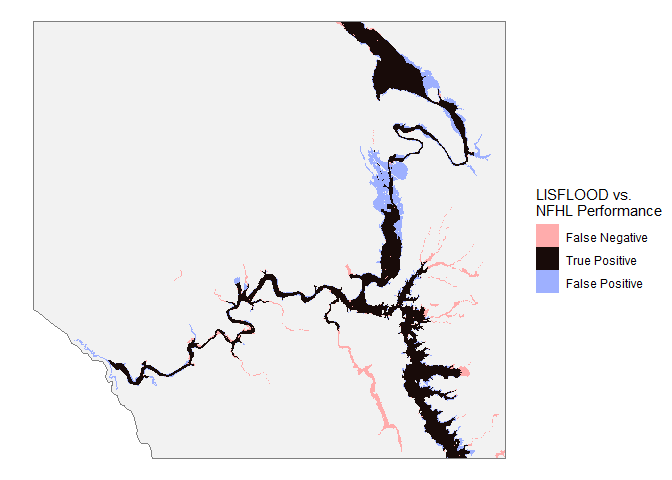

    ## setup information
    source('_data/setup.R')
    source('_data/plots.R')

    ## load location information
    load('_data/lisflood/dem.Rdata')
    load('_data/aoi/aoi.Rdata')

    ## load NFHL "observed" data
    load('_data/NFHL/NFHL.Rdata')

    ## load support functions for this markdown files
    source('_scripts/5_INUN/fit_inundation/5a_fit_lisflood/fit_lisflood_functions.R')

# Determine final accuracy

Last but not least, we determine the mismatch between our best-fit
LISFLOOD inundation map and the FEMA NFHL 100-year floodplain map. We
return to Sherlock to run one more simulation with the default + updated
parameter values. The accuracy metrics and the spatial comparison for
this “best-fit” simulation are shown below.

    bestfit <- raster('_scripts/5_INUN/fit_inundation/5b_run_bestfit/results/bestfit.max') %>%
      overlay(dem.hydro, fun = function(x,y) ifelse(is.na(y), NA, x))

    ## calculate confusion matrix statistics
    tb <- overlay(obs, bestfit, fun = confusion)[] %>% table

    ## report statistics
    stats <-
      c(hitrate = unname(tb['0'] / (tb['-1'] + tb['0'])) %>%
          percent(accuracy = 0.01),
        falsalarm = unname(tb['1'] / (tb['0'] + tb['1'])) %>%
          percent(accuracy = 0.01),
        fstat = unname(tb['0'] / sum(tb)) %>%
          percent(accuracy = 0.01),
        bias = unname(tb['1'] / tb['-1']) %>%
          comma(accuracy = 0.01))
    print(stats)

    ##   hitrate falsalarm     fstat      bias 
    ##  "87.54%"  "23.16%"  "69.26%"    "2.12"

These accuracy statistics are very similar to the ones found by Wing et
al. (2020) when comparing against the NFHL for the entire US. Therefore
this is considered to be an acceptable fit, and we will use the LISFLOOD
environment parameters calculated here for all further LISFLOOD
modeling.
