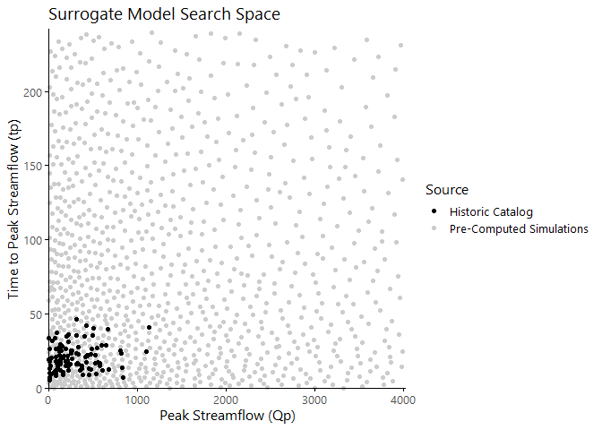

# 5d) Populate “grid” of LISFLOOD samples for surrogate modeling

Because of the computational expense in running LISFLOOD, we replace the
hydrodynamic simulation with a surrogate model. The surrogate model
rapidly produces inundation estimates based only on the inputs
*Q**p* (peak flow, m^3/s) and *t**p* (time to peak
flow, hrs).

In this step of the process, we generate sample combinations of
*Q**p* and *t**p* to populate the model search
space, i.e. the “grid.” We then calculate LISFLOOD inundation maps for
every sample combination in the grid to create a bank of pre-computed
results.
<!-- For new realizations, the surrogate model searches the grid to find the ``closest'' combination of $Q_p$ and $t_p$ and uses a weighted average of the associated pre-computed inundation maps to produce the new inundation estimate. -->

# Generate LISFLOOD simulations

This process was completed using Sherlock, Stanford’s high-performance
computing cluster. An outline of that process is enumerated below.

1.  Input best-fit parameters from step (a) in the appropriate sections
    in `generate_files.R` (m, LULC) and `run_lisflood.sh` (SGCn, SGCr,
    SGCp).
2.  Run `generate_files.sbatch` to
    1.  generate random samples of hydrograph parameters
        (*Q**p* & *t**p*) using Latin hypercube
        sampling (LHS), and
    2.  create .bci and .bdy files based on those hydrograph parameters
        for each sample index.
3.  Run `run_lisflood.sh` to generate .par files and calculate LISFLOOD
    inundation maps for each sample index.
4.  Update user-defined information at the top of `generate_zero.R` and
    `generate_files_2.R` to match `generate_files.R`.
5.  Run `generate_zero.sh` to create a “lower-bound” LISFLOOD map for
    the sample space. This prevents numerical errors when interpolating
    values for new combinations of *Q**p* and
    *t**p*.
6.  Once all simulations have finished running, run
    `cleanup_lisflood.sh` to organize LISFLOOD output files. *Please
    note that this could be several hours or days.*
7.  Run `generate_files_2.sbatch` to identify failed LISFLOOD model runs
    (either did not finish or did not reach the ocean) and recalculate
    .bci and .bdy files for these indices.
8.  Run `run_lisflood_2.sh` to regenerate .par files and recalculate
    LISFLOOD inundation maps for the failed model runs.
9.  Iterate steps 6-8 until the number of failed model runs meets some
    acceptable threshold, i.e. less than 5% of all indices.

<!-- -->

    ## load sample data
    samples.grid <- 
      read.table('_scripts/5_INUN/fit_inundation/5d_populate_grid/samples_grid.txt', header = TRUE)
    N <- nrow(samples.grid)

    ## determine which indices have valid LISFLOOD models associated with them
    id.file <- '_scripts/5_INUN/fit_inundation/5d_populate_grid/id.txt'
    if (file.info(id.file)$size > 0) {
      id <- read.table(id.file) %>% unlist %>% unname
    } else id <- c()
    sim.list <- (1:N)[!(1:N %in% id)]

    ## plot model search space (grid)

This plot shows the *Q**p* and *t**p* values in
the populated grid, compared against the values of *Q**p* and
*t**p* seen in the historic catalog. Note that there are many
values in the grid larger than the extent of the catalog because we want
to be able to capture the effects and impacts of storms not seen in the
historic record.

# Save sample dataframe for next step

In the next step of the fitting process, we will use 10-fold
cross-validation to determine best-fit hyperparameters for the surrogate
model. Here we prepare for that by assigning each sample an index
between 1 and 10 so that the cross-validation splits are consistent.

    ## add a cross-validation index column
    cv <- sample(1:10, size = length(sim.list), replace = TRUE)
    samples <- samples.grid %>% 
      mutate(sim = 1:nrow(.), cv = replace(NA, sim %in% sim.list, cv))

    ## add the lower-bound simulation as an extra row
    samples <- samples %>% 
      rbind(c(tp = 0, Qp = 0, sim = 1001, cv = NA))

    ## save out for Sherlock
    save(samples, file = '_scripts/5_INUN/fit_inundation/5d_populate_grid/samples_grid.Rdata')
